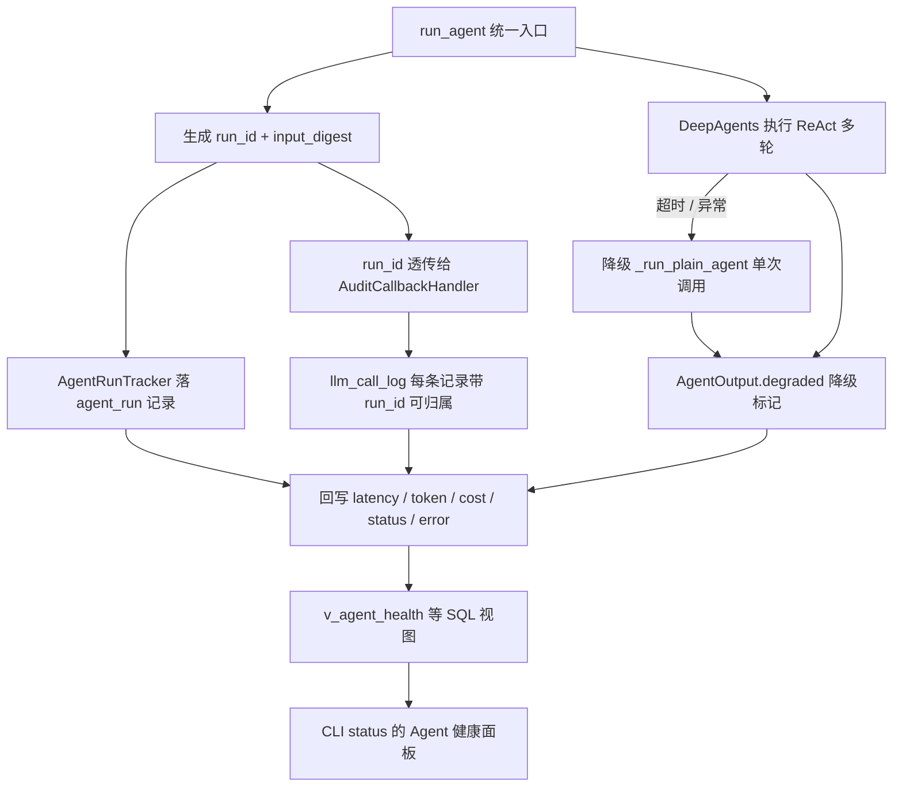

## 产品概述

为 fin-news 的 8 个 Agent（评分 / 宏观 / 行业 / 个股 / 盘前 / 盘后 / 写文章 / 追问）建立一套**看得见、能定位、可归因**的运行监控体系。交付分两部分：一份完整的方案文档（业界评估方案梳理 + 分层指标清单 + 指标异常时的优化预案），以及一套立刻生效的 P0 最小埋点闭环，先解决当前「盲飞」问题。

## 核心特性

**一、业界主流 Agent 评估方案梳理**（文档交付）

- 讲清楚三层评估体系（端到端 / 轨迹级 / 组件级）、OpenTelemetry GenAI 语义约定这一事实标准、主流指标矩阵与判定方式（确定性检查 vs LLM-as-judge）、工具生态横评
- 并结合本项目给出**适用性裁剪**：哪些该做（工具调用正确性、降级率）、哪些可后置（Safety、Plan Quality）

**二、分层指标清单**（文档交付，P0 / P1 / P2 三级）

- 每个指标给出：定义口径、计算 SQL、数据来源表、健康阈值建议
- P0 覆盖成功率、降级率、失败率、P95 延迟、单条与日成本、简报质量分布、链路积压
- P1 覆盖工具调用、重试与错误归因、Token 效率、评分一致率、样本可下钻
- P2 覆盖步骤效率、成本归因到渠道、漂移检测等

**三、指标异常时的改进与优化预案**（文档交付）

- 每个异常信号对应：排查路径 → 具体调参动作（落到 config.py 里的真实参数名）→ 预期效果与副作用

**四、P0 最小闭环落地**（代码交付）

- 启用从未写入过的 `agent_run` 埋点（当前 0 行），让每个 Agent 的运行状态、耗时、成本、降级情况可查
- 把编造的模型单价改为按模型配置、区分输入输出的真实单价，并提供历史成本重算
- 在 `fin_news.cli status` 里新增「Agent 健康」面板，按 Agent 展示运行数 / 成功率 / 降级率 / P95 延迟 / 成本

## 范围约束

不引入新组件（不装 Langfuse / Prometheus / OTel 全家桶）、不改评估集、不做告警与 Web 面板，均留后续迭代。

## 技术栈选型

沿用项目现有技术栈，零新组件（对应用户「轻量自建」选型）：

| 层 | 选型 | 说明 |
| --- | --- | --- |
| 埋点存储 | PostgreSQL（现有 fin-news-db） | 复用 `agent_run` / `llm_call_log` / `analysis_report` |
| ORM | SQLAlchemy 2.0 + asyncpg（现有） | 埋点写入用独立 `session_scope`，失败不影响主流程 |
| 指标聚合 | SQL 视图（Alembic 迁移管理） | CLI、后续 Web 面板、手工 SQL 共用同一口径 |
| 指标查询层 | 新增 `fin_news/observability/metrics.py` | 避免 SQL 散落在 cli.py |
| 展示 | 现有 CLI `status` 命令 | 复用已有的中文宽度对齐辅助函数 |
| 成本计算 | 新增 `fin_news/agents/llm/pricing.py` | 消除 client.py 与 callbacks.py 两份重复单价表 |


## 实现方案

### 第一部分：业界主流 Agent 评估方案（文档输出）

**1) 三层评估体系**（诊断栈：先看结果，再看路径，最后定位组件）

- **End-to-end（端到端，黑盒）**：任务是否完成 → Task Completion。不看过程，只看目标达成。
- **Trajectory-level（轨迹级）**：达成目标的路径是否高效合理 → Step Efficiency、Plan Adherence、Plan Quality。Agent 可以在每步都「看起来合理」的情况下走一条烂路。
- **Component-level（组件级）**：到底哪个部件坏了 → Tool Correctness、Argument Correctness、RAG 指标、子 Agent。端到端只能回答「坏了」，组件级才能回答「哪坏了」。

**2) 事实标准：OpenTelemetry GenAI 语义约定**

- 当前 v1.41，状态为 Development（属性名仍可能变更），但已可用于生产。
- 两个必须导出的核心指标：`gen_ai.client.operation.duration`（操作延迟）、`gen_ai.client.token.usage`（Token 消耗，区分 input/output）。
- 四种核心 Span：`invoke_workflow` → `invoke_agent` → `chat`（模型调用）/ `execute_tool`（工具调用）。
- 关键属性：`gen_ai.request.model`、`gen_ai.usage.input_tokens`、`gen_ai.usage.output_tokens`、`gen_ai.response.finish_reason`、`gen_ai.tool.name`。
- **核心原则**：埋点代码按 OTel 规范写，而非厂商私有 SDK。这样未来换后端（Langfuse → Braintrust → 自建）只改 Exporter，不改埋点。**本轮自建也应让字段命名向该规范靠拢，为将来留出升级路径**（例如 `llm_call_log` 的 prompt/completion_tokens 对应 `gen_ai.usage.*`，后续加字段时直接采用规范名）。
- 明确警告：**不要硬编码模型价格**，多家厂商 2026 年多次调价，价格必须外部化配置 —— 这正是本项目当前踩的坑。

**3) 指标矩阵与判定方式**

| 指标 | 衡量什么 | 判定方式 | 层次 |
| --- | --- | --- | --- |
| Task Completion | 是否达成用户目标 | LLM judge | 端到端 |
| Step Efficiency | 是否避免多余步骤、重试、空转循环 | LLM judge | 轨迹级 |
| Tool Correctness | 是否调用了正确的工具 | **确定性** | 组件级 |
| Argument Correctness | 工具入参是否正确 | LLM judge | 组件级 |
| Plan Quality / Plan Adherence | 计划是否完善、执行是否跑偏 | LLM judge | 轨迹级 |
| Reasoning Relevancy / Coherence | 推理是否切题、连贯 | LLM judge | 组件级 |
| RAG 五件套 | 检索质量与 grounded 程度 | LLM judge | 组件级 + 端到端 |
| Safety（Bias / Toxicity / Harmful） | 输出安全 | LLM judge | 端到端 / 组件级 |
| G-Eval | 任意自然语言定义的自定义标准 | LLM judge | 任意 |


**经验法则**：能用确定性判定的（工具名、必填参数、期望输出）绝不用 LLM judge；只有需要判断、需要上下文的才用 LLM-as-judge。

**4) 工具生态（本轮不引入，作为演进方向备查）**

- **Langfuse**：2026 最活跃开源方案，MIT 可自托管，原生 OTel，自带 Prompt 管理与数据集 —— 数据主权优先时首选。
- **LangSmith**：SaaS，5K traces/月起。
- **Arize Phoenix**：基于 OpenInference，擅长 embedding 可视化与检索评估。
- **Braintrust**：内置自动评分器。
- **Helicone**：代理网关，零代码改动（有单点故障风险）。
- **Datadog LLM Observability**：**仅对 LLM Span 计费**，工具调用密集型场景可能更便宜。

**5) 结合本项目的适用性裁剪**

- 本项目 Agent **不执行外部写操作**（不改库、不发消息、不提交代码），因此 **Safety、Plan Adherence 优先级低**，可后置。
- 本项目是「工具调用 + 长链路」型 Agent（ReAct 多轮、子 Agent 并行），因此 **Tool Correctness、Step Efficiency、降级率、超时率高度适用**。
- 本项目已有 `prompt_template` 版本化与 `score_eval_set` 评估集，具备离线评估基础；但评估集目前只覆盖评分一个环节，深度分析尚无自动评估 —— 本轮按用户决策不动，仅在运行指标中体现质量分布。

### 第二部分：分层指标清单（P0 / P1 / P2）

#### P0 —— 最关键，回答「能不能用」（本轮落地）

| 指标 | 口径 | 数据来源 | 健康阈值建议 |
| --- | --- | --- | --- |
| Agent 成功率 | status 为成功 的运行数 / 总运行数，按 agent_type | `agent_run` | ≥ 95% |
| **降级率** | degraded 的运行数 / 总运行数 | `agent_run` + `analysis_report` | ≤ 10% |
| 失败率 | status 为失败 的运行数 / 总运行数 | `agent_run` | ≤ 3% |
| 延迟 P50 / P95 | latency_ms 分位数，按 agent_type | `agent_run` / `llm_call_log` | 分析 ≤ 300s，评分 ≤ 60s |
| 单条成本 | 某 Agent 单次运行成本（分），按 agent_type | `agent_run` + `llm_call_log` | 与模型基线对齐 |
| 日成本 | 按天 × 模型汇总 cost | `llm_call_log` | 环比波动 ±30% 预警 |
| 简报质量分布 | PUBLISHED / DEGRADED / SUPERSEDED 占比 | `analysis_report` | DEGRADED ≤ 20% |
| 链路积压 | PENDING 与 overdue 事件数 | `ingest_event` | overdue 应为 0 |


> 已发现的 P0 级事实（新指标上线即可见）：analysis 角色错误率 **10.4%**（62/597）且错误平均耗时 **229 秒**（逼近 300s 超时上限）；**macro_policy 简报 6 条全部 DEGRADED、0 条 PUBLISHED**（100% 降级）；stock 降级率 33%、industry 17%。这三个问题当前指标完全看不见。

#### P1 —— 次要，回答「好不好用」（埋点就位后顺带可得）

| 指标 | 口径 | 数据来源 | 说明 |
| --- | --- | --- | --- |
| 工具调用失败率 | 工具 error 次数 / 工具调用次数 | **当前仅存在于日志** | 当前盲区，需落库后才能算 |
| 重试率 | attempt > 1 的运行占比 | `agent_run.attempt` | ≤ 10% |
| 错误归因分布 | 按 error_type 分组计数 | `agent_run` | 无单一类型占比过半 |
| Token 效率 | 单条平均 input / output token | `llm_call_log` | 观察环比 |
| 评分一致率 | band_agree_rate | `score_eval_set`（已有） | ≥ 80%（PRD 验收口径） |
| 样本可下钻 | 每次运行都能用 trace_id 关联到日志 | `agent_run.trace_id` | 100% 可追溯 |


#### P2 —— 锦上添花（明确不做，仅登记）

步骤效率（每次运行的 LLM 往返次数）、成本归因到渠道、上下文漂移检测、缓存命中率、人工反馈闭环。

### 第三部分：改进与优化预案

| 异常信号 | 排查路径 | 调参 / 改进动作 | 预期效果与副作用 |
| --- | --- | --- | --- |
| **降级率高**（如 macro_policy 100%） | 查 `agent_run` 的降级原因分布：超时 / deepagents 导入失败 / 其他异常 | 超时为主：调 `analysis_timeout_seconds`（300 → 600）、收紧 `agent_recursion_limit`（200 → 更低，防空转）、拆分子任务降低单步复杂度；临时设 `use_deep_agents=False` 对比验证是否为深度链路本身的问题 | 放宽超时会拉长最坏耗时、抬高成本；收紧步数可能导致复杂任务做不完，需配合观察成功率 |
| **失败率高**（如 analysis 10.4%） | 查 `llm_call_log.error_message` 分布，区分 429 限流 / 超时 / JSON 解析失败 | 429 为主：降 `analysis_concurrency`（4 → 2）、为分析链路引入类似 `embedding_qps` 的 QPS 闸门；超时为主：调 `llm_timeout_seconds`（120）；解析失败为主：加固 `parse_json_content` 并在 prompt 中强化 schema 约束 | 降并发会拉低吞吐；需与积压指标联动看，避免治好失败率却堆出积压 |
| **延迟 P95 高** | 按 agent_type 拆开看是评分慢还是分析慢；再看是模型慢还是工具慢 | 评分慢：调小 `scoring_sub_batch_size`（5 → 3）让小批更快返回；分析慢：调 `analysis_concurrency`；考虑评分继续用轻量模型（`volcengine_model_scoring`）、只在分析用强模型 | 拆分更细会增加调用次数与固定开销，需同时看成本指标 |
| **成本超预算** | 按 agent_type 与 model 拆成本，定位是哪个环节烧钱 | 调高 `score_threshold_vectorize`（3 → 4）减少进入分析链路的资讯量；确认评分走小模型、分析才走大模型；对低价值内容直接归档 | 提高阈值会漏掉部分中等价值资讯，需结合评分一致率与人工抽查确认未误杀 |
| **质量差（DEGRADED 多）** | 抽取降级样本，用 trace_id 关联日志看卡在哪一步；对比降级与正常输出的差异 | 迭代 prompt（利用已就绪的 `prompt_template` 版本化做 A/B）；补充 few-shot 示例；对长文本调 `scoring_max_content_chars` | Prompt 改动需用评估集回归确认无退化（本轮不动评估集，改 prompt 时人工抽查） |
| **积压上涨** | 查 `ingest_event` 的 PENDING / overdue 分布与 `attempts` | 调 `worker_batch_limit`、`worker_poll_interval_seconds`；降低 `event_backoff_base_seconds`（30）加快重试；必要时扩 worker | 加快重试可能放大对下游 LLM 的压力，需与失败率联动 |
| **成本 / token 突增** | 对比同 agent_type 的历史 token 均值 | 检查是否陷入重复工具调用或循环：收紧 `agent_recursion_limit`；开启 `agent_trace_enabled` 看步骤日志 | 收紧步数可能影响复杂任务完成度 |


### 第四部分：P0 最小闭环落地设计

**4.1 埋点切入点：一处即可覆盖全部分析 Agent**

`run_agent()`（`src/fin_news/agents/base.py:147`）是 MACRO_POLICY / INDUSTRY / STOCK / PRE_MARKET / POST_MARKET / WECHAT_ARTICLE 的统一入口，在此埋点即可覆盖全部分析类 Agent，无需逐个改。

数据流：



**4.2 关键设计决策与权衡**

| 决策 | 选择 | 理由 / 权衡 |
| --- | --- | --- |
| 降级标记存哪 | 优先复用 `RunStatus` 枚举；若无 DEGRADED 值，先写 `payload["degraded"]`（零迁移） | 本轮求快、避免迁移风险；等该字段需高频过滤时再升级为独立列 |
| token 从哪取 | 优先按 `run_id` 从 `llm_call_log` 聚合回填 | `_run_deep_agent` 的 `_extract_usage` 取不到时会记 0；而 `llm_call_log` 由 `AuditCallbackHandler` 从 `usage_metadata` 取，实测 3264 行中仅 8 行为估算值，**更可信** |
| 埋点失败如何处理 | try/except 吞掉并告警，**绝不影响主流程** | 沿用项目既有 `_log_call` 的模式 |
| `subject_type` / `subject_id` | 作为**可选参数**加到 `run_agent` 签名，由调用方（analysis_agents / market_agents）传入 news_id 或日期 | 向后兼容；不传时留空，且 `uq_run_idem` 唯一索引对 NULL 不生效，不会误去重 |
| 幂等 | 复用已有 `uq_run_idem`（agent_type + subject_id + prompt_version + input_digest） | 表已建好，直接用，避免重复跑污染指标 |
| 单价存放 | config 配置项为主（可按环境变量覆盖），**不硬编码** | 遵循 OTel 规范警告；模型会调价；且便于按新单价重算历史成本 |
| 视图 vs 内联 SQL | 建 SQL 视图（Alembic 迁移） | 用户明确选择「SQL 视图做指标聚合」；CLI 与未来 Web 面板共用同一口径，避免两处 SQL 漂移 |
| 历史数据回补 | 面板分两块：`agent_run`（新数据，按 agent_type）+ `llm_call_log`（3264 行历史，按 role × model） | `agent_run` 从 0 开始，若无历史视图则面板上线即空白；用 `llm_call_log` 兜底保证「当天就有东西看」 |


**4.3 单价模块设计（消除重复 + 支持重算）**

现状问题：`client.py:288` 与 `callbacks.py:23` 各有一份重复的 `_PRICE_PER_1K_CENT = {"scoring": 0.05, "analysis": 0.6, "qa": 0.6, "embedding": 0.01}`，不区分 input/output、不区分具体模型、数字是编造量级，导致全表 `cost_cent` 不可信。

改造：新建 `src/fin_news/agents/llm/pricing.py` 作为**唯一**计价入口，两处调用方统一改为引用它。单价按 **model 名**配置、区分 input/output，单位为「元 / 百万 token」，配置放在 `config.py`（可用环境变量覆盖）。初始值填入公开量级并**在注释中明确标注为占位值、需按火山方舟控制台实际单价校准**。同时提供按新单价重算历史 `cost_cent` 的能力 —— 因为 token 已真实存储（estimated 仅 8 行），单价改错也能重算，不会污染数据。

## 实现备注（防止回归的关键点）

1. **埋点不能拖慢主链路**：写入用独立 `session_scope`，与业务事务分离；异常全部 try/except 吞掉并记 warning，参照现有 `_log_call` 写法。
2. **并发安全**：`AuditCallbackHandler` 的注释已明确其状态按 run_id 隔离、可安全并发复用，透传 run_id 不会引入并发问题；`_build_chat_model` 每次调用都新建 handler，不要在多个 run 间共享。
3. **`_run_deep_agent` 的 token 可能为 0**：`_extract_usage` 取不到就返回 (0, 0)。因此 agent_run 的 token 必须以 `llm_call_log` 聚合为准，不能直接采信 `AgentOutput` 的值。
4. **不要动 `AgentRun` 的主键与既有索引**：若需新增字段走 Alembic；本轮优先用 `payload` JSONB 承载，避免迁移风险。
5. **视图用普通视图而非物化视图**：数据量级小（agent_run 每天几百到几千行），物化视图需维护刷新策略，属过度设计。
6. **CLI 输出保持中文与既有风格**：复用 `_cmd_status` 里已有的 `_w()` / `_l()` / `_r()` 中文宽度对齐辅助函数，新增表格直接沿用，保持与刚加的「渠道分布」表观一致。
7. **验证方式**：改完跑 `uv run ruff check` 与 `uv run pytest`；埋点生效后跑一次分析任务，用 `docker exec fin-news-db psql` 核对 `agent_run` 有新行、`llm_call_log.run_id` 有值、视图能查出聚合结果。
8. **blast radius 控制**：埋点为**新增写入**，不改变任何既有业务行为；单价改动会改变 `cost_cent` 数值（这正是修复目的），但不动 token 与 latency。

## 架构设计

整体分为四层，职责单一、可逐步演进：

```mermaid
flowchart LR
    subgraph L1["采集层（已有 + 本轮增强）"]
        A1["AuditCallbackHandler → llm_call_log"]
        A2["StepTraceHandler → 仅日志（P1 待落库）"]
        A3["本轮新增：run_agent → agent_run"]
    end
    subgraph L2["存储层（PostgreSQL）"]
        B1["agent_run"]
        B2["llm_call_log"]
        B3["analysis_report / news_score"]
    end
    subgraph L3["聚合层（本轮新增）"]
        C1["SQL 视图 v_agent_health / v_llm_daily"]
        C2["observability/metrics.py 查询封装"]
    end
    subgraph L4["消费层"]
        D1["CLI status Agent 健康面板（本轮）"]
        D2["Web 面板 / 告警（后续）"]
    end
    L1 --> L2 --> L3 --> L4
```



- **采集层**：不改任何业务逻辑，只在外层加观测。
- **存储层**：复用现有表，`agent_run` 从「从未使用」激活为「主运行表」。
- **聚合层**：SQL 视图保证口径唯一；`metrics.py` 封装查询，供 CLI 与后续 Web / API 复用，避免 SQL 散落。
- **消费层**：本轮只做 CLI；未来接 Web 面板或 Grafana 时直接查同一批视图，无需重做。

## 目录结构

```
fin-news-v5/
├── docs/
│   └── 09-agent-observability.md          # [NEW] 方案主文档。三部分：①业界主流 Agent 评估方案梳理（三层评估体系、OTel GenAI 语义约定、指标矩阵与判定方式、工具生态横评、结合本项目的适用性裁剪）②分层指标清单（P0/P1/P2 每级给出指标定义、计算 SQL 口径、数据来源表、健康阈值建议）③改进与优化预案（异常信号 → 排查路径 → 具体调参动作 → 预期效果与副作用，参数名落到 config.py 实际字段）。同时点名当前已发现的四个现存问题作为「新指标上线后应立刻验证的靶点」
├── src/fin_news/
│   ├── core/
│   │   └── config.py                      # [MODIFY] 新增 model_pricing 配置项（按 model 名、区分 input/output，单位元/百万 token），支持环境变量覆盖；初始值标注为占位需校准
│   ├── agents/
│   │   ├── base.py                        # [MODIFY] 核心埋点：run_agent 增加可选 subject_type/subject_id 参数；生成 run_id 与 input_digest；用 AgentRunTracker 落 agent_run（含 started_at/finished_at/latency_ms/status/degraded/model/prompt_version/error_type/error_message/trace_id）；_build_chat_model 把 run_id 透传给 AuditCallbackHandler
│   │   └── llm/
│   │       ├── pricing.py                 # [NEW] 唯一计价入口。消除 client.py 与 callbacks.py 的重复单价表；按 model 名 + input/output 分别计价；提供 recalc_cost(prompt_tokens, completion_tokens, model) 供历史重算
│   │       ├── client.py                  # [MODIFY] 删除本地 _PRICE_PER_1K_CENT 与 _estimate_cost_cent，改为引用 pricing.py
│   │       └── callbacks.py               # [MODIFY] 同上删除重复单价表；确认 run_id 正确写入 llm_call_log
│   ├── models/
│   │   └── event.py                       # [MODIFY] 检查 RunStatus 枚举：若含 DEGRADED 则直接用 status 记录降级；否则降级标记走 payload JSONB（零迁移）。按需补充注释说明各字段归属
│   ├── observability/
│   │   ├── __init__.py                    # [NEW] 模块导出
│   │   └── metrics.py                     # [NEW] 指标查询封装：agent_health(since) / llm_daily(since) / report_quality() / backlog()。返回 dataclass，供 CLI 与未来 Web/API 复用，避免 SQL 散落
│   └── cli.py                             # [MODIFY] _cmd_status 新增「Agent 健康」section：按 agent_type 展示运行数/成功率/降级率/失败率/P50·P95 延迟/平均 token/成本（来自 agent_run）；附「模型调用」块按 role × model 展示历史（来自 llm_call_log，兜底无 agent_run 历史时面板不空白）；简报质量分布（来自 analysis_report）。复用现有 _w/_l/_r 对齐函数
└── alembic/versions/
    └── xxxx_agent_run_metrics.py          # [NEW] 迁移：建 v_agent_health（按 agent_type 聚合近 24h/7d 的运行数、成功率、降级率、失败率、P50/P95 延迟、token、成本）与 v_llm_daily（按天 × role × model 聚合调用数、错误率、token、成本）两个普通视图；如需新增 AgentRun 字段则一并处理
```

## 关键代码结构

**1) 唯一计价入口（消除重复、支持重算）**

```python
# src/fin_news/agents/llm/pricing.py
@dataclass(frozen=True)
class ModelPrice:
    """单个模型的单价，单位：元 / 百万 token。"""
    input_per_mtok: float
    output_per_mtok: float

def price_of(model: str, settings: Settings | None = None) -> ModelPrice:
    """按 model 名查单价，未命中则回落到同 provider 的默认档并标记。"""

def calc_cost_cent(model: str, prompt_tokens: int, completion_tokens: int,
                   *, settings: Settings | None = None) -> float:
    """计算单次调用成本（分）。client.py 与 callbacks.py 统一调用此函数。"""
```

**2) Agent 运行埋点（一处覆盖全部分析 Agent）**

```python
# src/fin_news/agents/base.py —— 签名扩展为可选参数，向后兼容
async def run_agent(
    agent_type: AgentType,
    system_prompt: str,
    user_prompt: str,
    *,
    tools: Sequence[Any] | None = None,
    settings: Settings | None = None,
    subject_type: str = "",          # 新增：news / brief / article
    subject_id: str | None = None,   # 新增：news_id 或日期，用于幂等与下钻
) -> AgentOutput: ...

class AgentRunTracker:
    """一次 Agent 运行的埋点上下文；异常吞掉，绝不影响主流程。"""
    def __init__(self, agent_type: AgentType, *, run_id: str, subject_type: str,
                 subject_id: str | None, prompt_version: str, input_digest: str) -> None: ...
    async def __aenter__(self) -> AgentRunTracker: ...   # 写 PENDING + started_at
    async def finish(self, output: AgentOutput, *, status: RunStatus,
                     error: BaseException | None = None) -> None: ...  # 回写结果与耗时
```

**3) 指标查询封装（口径唯一，CLI 与未来 Web 共用）**

```python
# src/fin_news/observability/metrics.py
@dataclass
class AgentHealthRow:
    agent_type: str
    runs: int
    success_rate: float
    degraded_rate: float
    failed_rate: float
    p50_ms: int
    p95_ms: int
    avg_prompt_tokens: int
    avg_completion_tokens: int
    cost_cent_total: float

async def agent_health(session: AsyncSession, *, since_hours: int = 24) -> list[AgentHealthRow]: ...
async def llm_daily(session: AsyncSession, *, since_days: int = 7) -> list[LLMDailyRow]: ...  # 来自 llm_call_log，兜底历史
async def report_quality(session: AsyncSession) -> list[ReportQualityRow]: ...  # PUBLISHED/DEGRADED/SUPERSEDED 分布
```