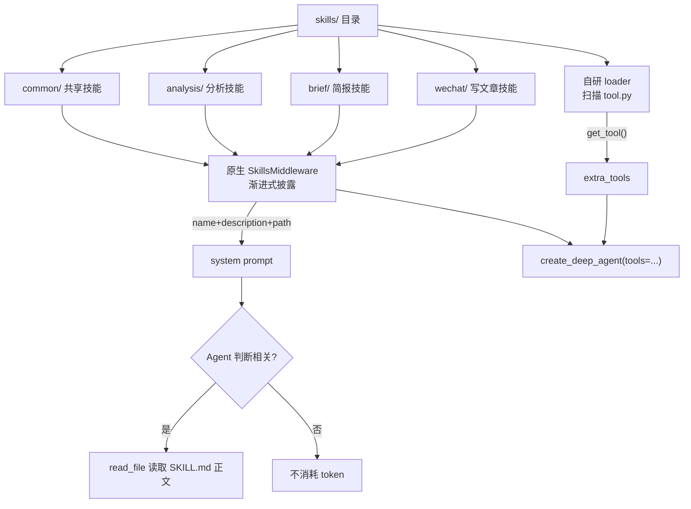
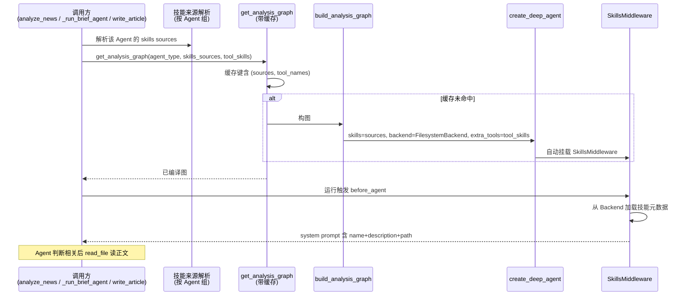

## 产品概述

让各类 Agent 能够调用安装在 `skills/` 目录的技能，**优先采用 DeepAgents 原生方案**（`create_deep_agent(skills=[...])` + 自动挂载的 `SkillsMiddleware`），替代项目自研的「全量注入」loader；同时保留原生不支持的**工具型技能**（`tool.py`）能力。

## 核心特性

**一、提示词型技能走 DeepAgents 原生（渐进式披露）**

- 每个技能为 `skills/<group>/<skill-name>/SKILL.md`，含 YAML frontmatter（`name`/`description`/`allowed-tools`）
- 原生中间件只在 system prompt 放入 **name + description + path**，Agent 判断相关时用 `read_file` 自行读取正文
- 技能正文不再无条件进入 prompt，技能数量增长时 token 成本远低于现状

**二、工具型技能保留自研加载**

- DeepAgents 原生不支持通过技能定义新工具（只有 `allowed-tools` 引用已有工具）
- 因此 `tool.py` → `get_tool()` 的自研加载继续保留，产出的工具通过 `extra_tools` 挂入 Agent

**三、按 Agent 分组的技能归属**

- 目录分组：`skills/common/`（共享）+ `skills/analysis/`、`skills/brief/`、`skills/wechat/`
- 利用原生多 source 分层能力（后者覆盖前者），每个 Agent 组只挂载自己的 source 列表

**四、覆盖范围**

- 接入：宏观/行业/个股分析 Agent、盘前/盘后简报 Agent、写文章 Agent
- 不启用：评分 Agent（非 DeepAgents 图，高频低延迟，注入会显著抬高 token 成本）
- 追问 Agent 为 legacy 非图化实现，本轮不纳入

**五、可观测**

- 记录每个 Agent 加载了哪些技能来源与技能名，避免「技能到底生效没」不可见

## 范围约束

- 优先复用 DeepAgents 原生能力，不重复造轮子
- 评分与追问链路不改（明确不启用）
- 需要一个示例技能用于端到端验证

## 技术栈选型

沿用现有技术栈，零新组件：

| 层 | 选型 | 说明 |
| --- | --- | --- |
| Agent 框架 | DeepAgents（`create_deep_agent`） | 复用其原生 `skills` 参数与 `SkillsMiddleware` |
| 技能存储后端 | `FilesystemBackend` / `CompositeBackend` | 原生技能只能经 Backend 加载，不能直连文件系统 |
| 工具型技能 | 自研 `agents/skills/loader.py` | 原生不支持，继续保留 `tool.py` → `get_tool()` |
| 后端 | FastAPI + SQLAlchemy async + PostgreSQL | 不变 |
| 配置 | pydantic-settings | 新增技能来源与开关 |


## 实现方案

### 总体思路

**核心判断：原生方案在「提示词型」上全面优于自研 loader，但在「工具型」上有能力缺口**，因此采用混合方案：



**为什么提示词型优先用原生**（关键权衡）：

| 维度 | 自研 loader | 原生 SkillsMiddleware |
| --- | --- | --- |
| 注入方式 | 全量拼接正文进 system prompt | 仅 name+description+path，用时 `read_file` |
| token 成本 | 所有技能正文都进 prompt，越多越贵 | 只有被判定相关并读取的才进 context |
| 图缓存 | 正文烘焙进 prompt，改技能需重建图 | **技能在 `before_agent` 每次运行加载，图可继续缓存** |
| 工具型 | 支持 | 不支持（本方案保留自研补齐） |
| 分组归属 | 无（一个目录全给） | 多 source 分层，可按 Agent 配置 |
| 安全 | 无 | `allowed-tools` 限制 + `virtual_mode` 路径防护 |


**最重要的性能结论**：原生技能以「source 路径」形式传给构图函数，技能正文由 `SkillsMiddleware.before_agent` 在**每次运行时**从 Backend 加载，并非常量烘焙进图。因此**接入技能不会破坏现有图缓存**，改技能文件也无需清缓存——这恰好解决了自研方案「为动态注入而放弃缓存」的痛点。

### 关键设计决策

| 决策 | 选择 | 理由 |
| --- | --- | --- |
| 提示词型技能 | DeepAgents 原生 `skills=` 参数 | 渐进式披露省 token；图可继续缓存；原生多 source 分层 |
| 工具型技能 | 保留自研 `load_skills` 的 `tool.py` 分支 | 原生无定义新工具的能力，必须自研补齐 |
| 技能归属 | 目录分组 `skills/<group>/` + 每 Agent 组配 source 列表 | 原生 source 天然支持；比 frontmatter 加 `agents` 字段更直观、更符合原生用法 |
| Backend | `FilesystemBackend(root_dir=skills_dir, virtual_mode=True)`；如需隔离再升级 `CompositeBackend` | 原生技能只经 Backend 加载；`virtual_mode=True` 阻断路径穿越，把 Agent 文件操作限制在 skills 目录内 |
| 缓存键 | 增加 `(skills_sources, tool_skill_names)` | 技能来源与工具型技能变化时才重建图；技能正文变化不触发重建 |
| 评分 Agent | 默认不启用 | 非 DeepAgents 图（自研 StateGraph），且高频低延迟（每批 30 条），注入提示词显著抬高成本 |
| 追问 Agent | 本轮不纳入 | legacy 非图化，无原生挂载点 |


### 边界情况

1. **`read_file` 依赖**：原生渐进式披露要求 Agent 能读文件，由自动挂载的 `FilesystemMiddleware` 提供；Backend 必须能解析技能路径，否则 Agent 读不到正文（表现为技能列表有、内容取不到）
2. **Backend 作用域**：切到 `FilesystemBackend` 后，Agent 的文件类工具作用域变为 skills 目录；用 `virtual_mode=True` 收敛风险，必要时用 `CompositeBackend` 把 `/skills/` 路由到磁盘、其余保留内存态
3. **source 路径语义**：原生 source 路径是**相对 backend root 的 POSIX 路径**（如 `["/common/", "/analysis/"]`），不是宿主机绝对路径
4. **技能名冲突**：多 source 下同名技能后者覆盖前者（`common` 应放在列表前面）
5. **工具型技能影响缓存**：`extra_tools` 会烘焙进图，因此其名称列表必须进缓存键
6. **SKILL.md 规范**：`name`（1-64 字符）与 `description` 为必填，缺失或超限的技能会被原生跳过并告警
7. **`skills/` 目录当前为空**：需同步提供示例技能，否则无法验证链路

## 实现备注（防回归要点）

1. **不要删自研 loader**：其 `tool.py` 分支是原生的能力缺口，保留；仅提示词型改走原生
2. **`build_analysis_graph` 是唯一构图出口**：新参数在此集中加，不要在调用方各处拼 `create_deep_agent`
3. **保持图缓存**：接入技能后仍需走 `get_analysis_graph` 缓存路径，避免重蹈公众号 Agent「不缓存图」导致的性能退化
4. **`system_prompt` 在图路径下的既有行为不改**：`_run_analysis` 接收的 `system_prompt` 目前只作用于降级路径，本次不改动该语义，技能提示词统一由原生中间件负责
5. **降级路径**：DeepAgents 图失败降级到 `_run_plain_agent` 时，原生技能不生效；如需覆盖，可在降级时用自研 `render_prompt_suffix` 兜底注入（可选，低优先级）
6. **日志**：记录 `skills_sources`、`prompt_skills` 与 `tool_skills` 的名称与数量，避免技能静默失效
7. **blast radius**：只在构图函数与三个调用点加参数，不动评分/向量化/检索逻辑；`skills` 为空时行为与现状完全一致

## 架构设计

### 技能加载链路



### 目录结构与文件

```
fin-news-v5/
├── skills/                                  # [MODIFY] 从空目录改为分组结构
│   ├── README.md                            # [MODIFY] 更新为「各 Agent 共享 + 分组」说明
│   ├── common/                              # [NEW] 所有 Agent 共享的技能
│   ├── analysis/                            # [NEW] 宏观/行业/个股分析 Agent
│   │   └── <sample-skill>/SKILL.md          # [NEW] 示例技能，用于端到端验证
│   ├── brief/                               # [NEW] 盘前/盘后简报 Agent
│   └── wechat/                              # [NEW] 写文章 Agent
├── src/fin_news/
│   ├── core/config.py                       # [MODIFY] 新增 skills 来源与启用开关
│   ├── agents/
│   │   ├── graphs/analysis_graphs.py        # [MODIFY] build_analysis_graph 加 skills/backend 参数；
│   │   │                                    #          get_analysis_graph 缓存键扩展
│   │   ├── analysis_agents.py               # [MODIFY] analyze_news/_run_analysis 解析并传入技能
│   │   ├── market_agents.py                 # [MODIFY] _run_brief_agent 同上
│   │   ├── wechat_agent.py                  # [MODIFY] 提示词型迁移原生，工具型保留
│   │   └── skills/loader.py                 # [MODIFY] 保留 tool.py 分支；提示词型标注为降级兜底
│   └── observability/                       # 复用既有日志能力记录技能加载
└── tests/
    └── test_agent_skills.py                 # [NEW] 技能来源解析、缓存键、工具型加载测试
```

## 关键代码结构

**1) 构图函数的新参数（唯一改动出口）**

```python
def build_analysis_graph(
    agent_type: AgentType,
    settings: Settings | None = None,
    *,
    response_format: Any = None,
    system_prompt: str | None = None,
    extra_tools: list[Any] | None = None,
    skills: list[str] | None = None,        # [NEW] 原生技能来源（相对 backend root）
    backend: Any | None = None,             # [NEW] 技能存储后端，缺省用 FilesystemBackend
) -> Any:
    """skills 为 DeepAgents 原生技能来源路径；工具型技能仍走 extra_tools。"""
```

**2) 按 Agent 组解析技能来源**

```python
# 目录分组：common 为共享层，放最前（同名技能被后面的覆盖）
SKILL_GROUPS: dict[AgentType, tuple[str, ...]] = {
    AgentType.MACRO_POLICY: ("common", "analysis"),
    AgentType.INDUSTRY:     ("common", "analysis"),
    AgentType.STOCK:        ("common", "analysis"),
    AgentType.PRE_MARKET:   ("common", "brief"),
    AgentType.POST_MARKET:  ("common", "brief"),
    AgentType.WECHAT_ARTICLE: ("common", "wechat"),
}

def skill_sources_for(agent_type: AgentType, settings: Settings) -> list[str]:
    """返回传给 create_deep_agent 的 POSIX 风格来源路径（相对 backend root）。"""
```

**3) 缓存键扩展**

```python
def _cache_key(agent_type, spec_or_version, settings, *, skills=(), tool_names=()):
    # 技能来源与工具型技能名称参与缓存；技能正文变化不触发重建（原生每次运行加载）
    return (agent_type, version, provider, model, tuple(skills), tuple(tool_names))
```

## Agent Extensions

### SubAgent

- **code-explorer**
- Purpose: 实施前精确核实 `deepagents` 包的 Backend 细节——`FilesystemBackend` 是否支持只读/权限约束、`CompositeBackend` 的路由写法、`SkillsMiddleware` 对 `read_file` 的具体依赖，以及 `create_deep_agent` 的 `skills`/`backend` 参数在当前安装版本下的确切签名
- Expected outcome: 输出可直接落地的 Backend 选型结论与参数签名，避免因版本差异导致技能加载不到或 Agent 文件操作范围失控