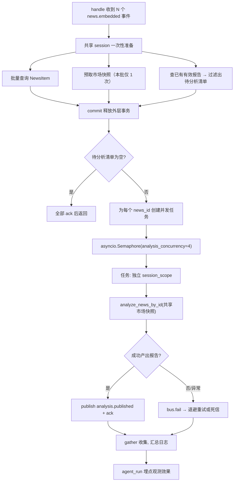
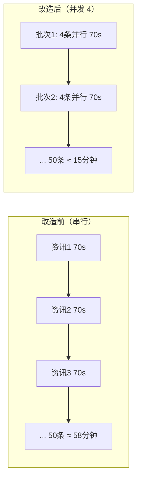

## 产品概述

将深度分析链路（个股 / 行业 / 宏观）从**串行**改造为**受控并发**执行，并顺带消除两个明显的浪费点。目标是在不改变任何分析结果的前提下，把单批资讯的分析吞吐提升数倍。

## 核心特性

1. **受控并发执行**：一批资讯按 `analysis_concurrency` 并发分析，而非逐条等待（当前单条 70~360 秒，一批 50 条串行需约 58 分钟）
2. **让 `analysis_concurrency` 配置真正生效**：该配置目前对深度分析链路完全不起作用（是"摆设"），本次修复使其实际控制并发上限
3. **市场快照每批预取一次共享**：同一交易日内所有资讯的市场快照完全相同，改为一批只查一次，省掉 N-1 次重复查询
4. **已有有效报告的资讯跳过**：避免同一条资讯被重复分析、重复烧钱；降级报告单独计数并告警，不把质量问题藏起来
5. **失败隔离**：单条资讯分析失败不影响同批其他资讯，各自独立事务、独立重试

## 范围约束

- 不改变任何分析结果（三项优化均为等价优化）
- 并发度保守保持 4，不做单条耗时优化（收紧 `agent_recursion_limit`、调 `analysis_timeout_seconds` 等）留后续
- 改造后通过已建好的 `agent_run` 埋点观测效果，再决定是否上调并发度

## 技术栈选型

沿用项目现有技术栈，零新组件：

| 层 | 选型 | 说明 |
| --- | --- | --- |
| 并发模型 | `asyncio.Semaphore` + `asyncio.gather` | 与评分链路（`scoring_agent.py:77-85`）保持一致的既有模式 |
| 并发闸门 | `get_semaphore("analysis", settings)` | `agents/llm/limiter.py:11` 已实现，本次接入分析链路 |
| 会话隔离 | 每任务独立 `session_scope()` | SQLAlchemy `AsyncSession` 非并发安全，必须隔离 |
| 观测验证 | `agent_run` 埋点 + `v_agent_daily` 视图 | 上一轮刚建成，用于前后对比 |


## 实现方案

### 核心思路

把 `on_embedded.handle()` 里的 `for event in events: await analyze_news(...)` 改为：**先用共享 session 做一次性准备（批量查询 + 预取市场快照 + 去重过滤），再对需要分析的资讯发起并发任务，每个任务持有独立 session 和独立事务，由信号量控制同时在飞的数量**。

### 三个必须解决的技术约束

**1. `AsyncSession` 不是并发安全的**

当前 `analyze_news(session, news, settings)` 使用 handler 传入的共享 session，直接 `gather` 会出问题。项目已提供 `analyze_news_by_id(session, news_id, settings)`（`analysis_agents.py:123`），它内部自己 `select(NewsItem)`，天然适配"每任务一个独立 session"的模式。

**2. 跨 session 不能传 ORM 对象**

并发任务内构造 `EventBus(s, worker_id)` 时：

- `bus.ack()` / `bus.fail()` 均接受 `int` 类型的 event id（`bus.py:117`、`bus.py:126`），**只能传 `event.id` 不能传 event 对象**
- `worker_id` 应从外层 `bus.worker_id` 取真实值传入，避免 `locked_by` 被写成默认的 `"worker-1"`

**3. 日志上下文必须移入各任务内部**

现有 `bind_context(news_id=..., agent=...)` / `unbind_context(...)` 在串行循环里。`asyncio.gather` 下每个 task 有独立的 contextvars 副本（并发安全），但 bind/unbind 必须成对移进各任务的 `try/finally` 中，否则并发时日志会串扰。

### 关键设计决策

| 决策 | 选择 | 权衡理由 |
| --- | --- | --- |
| 事件确认位置 | 各并发任务内独立事务完成「分析 → 发布事件 → ack/fail」 | 保证单条资讯的分析与事件状态原子一致；失败时只回滚该条 |
| 外层 session 职责 | 仅做一次性查询，查询后立即 commit 释放 | 避免长期占用连接，且不持有行锁阻塞内层 UPDATE |
| 共享上下文传递 | 新增**可选**参数，不传时行为与现状完全一致 | 向后兼容，`analyze_news` 的其他调用方不受影响 |
| 预取内容 | `market` 的 `json.dumps(...)[:2000]` 字符串 | 与 `_build_context` 现有处理完全一致，结果等价 |
| 去重口径 | 已有 PUBLISHED → 跳过；已有 DEGRADED → 也跳过但单独计数告警 | 避免重复烧钱；同时不掩盖 `macro_policy` 100% 降级这类质量问题 |
| 失败处理 | `gather(..., return_exceptions=True)`，任务内自行 `bus.fail()` | 单条失败不影响同批其他；仍走原有的退避重试 / 死信机制 |


### 降级报告跳过的设计权衡（需明确）

上一轮发现 `macro_policy` 简报 6 条全部 DEGRADED、0 条 PUBLISHED。若把 DEGRADED 也算"已有有效报告"而静默跳过，降级将永远不会被自动重试。

本次采用：**DEGRADED 也跳过，但单独计数并打 warning 日志**，格式类似「跳过 N 条已有报告（其中 M 条为降级）」。这样既不重复烧钱，又让降级问题在日志中持续可见，是否重跑由人工决定。

## 实现备注

1. **并发度风险**：并发从 1 → 4 会把模型侧 QPS 提高 4 倍。当前 analysis 已有 9.4% 错误率、P95 361.5s（超 300s 超时线），改造后必须观察错误率是否上升——这是后续能否上调并发度的唯一依据。配置已生效，随时可调。
2. **连接池容量**：`db_pool_size=10`、`db_max_overflow=20`（上限 30）。并发 4 个分析 session + 外层 1 个 = 5，远低于上限；但需在文档中提示：若上调并发度，需同步核对连接池。
3. **不要丢观测**：并发下 `AgentRunTracker`（`agent_run` 埋点）与 `run_id` 通过 contextvars 按 task 隔离，天然安全，改造不应破坏这条链路。
4. **超时预算**：`analysis_timeout_seconds=300` 是单条任务的超时，并发下每条各自计时，不受影响。
5. **blast radius**：仅改事件处理层的执行方式，不动 Agent 内部逻辑、不动评分/向量化链路。

## 架构设计



改造前后对比：



## 目录结构

```
fin-news-v5/
├── src/fin_news/
│   ├── agents/
│   │   └── analysis_agents.py              # [MODIFY] 打通共享上下文的可选参数：
│   │                                       #   - analyze_news(..., market_json=None)
│   │                                       #   - analyze_news_by_id(..., market_json=None)
│   │                                       #   - _build_context(..., market_json=None)：有值时跳过
│   │                                       #     latest_trade_date + market_snapshot 两次查询
│   │                                       #   不传参数时行为与现状完全一致（向后兼容）
│   ├── pipeline/handlers/
│   │   └── on_embedded.py                  # [MODIFY] 核心改造：
│   │                                       #   1. 预取市场快照（一批一次）
│   │                                       #   2. 查已有有效报告，过滤待分析清单（DEGRADED 单独计数告警）
│   │                                       #   3. 每任务独立 session_scope + 独立 EventBus(bus.worker_id)
│   │                                       #   4. get_semaphore("analysis") 控并发
│   │                                       #   5. asyncio.gather(return_exceptions=True) 汇总
│   │                                       #   6. bind_context/unbind_context 移入各任务 try/finally
│   ├── core/
│   │   └── config.py                       # [MODIFY] 新增 analysis_skip_existing: bool = True
│   │                                       #   （是否跳过已有有效报告的资讯，可关闭以便强制重跑）
└── tests/
    └── test_on_embedded_parallel.py        # [NEW] 并发路径测试：
                                            #   - 并发下每任务独立 session（无共享 session 冲突）
                                            #   - 单条失败不影响其他（失败隔离 + bus.fail 被调用）
                                            #   - 共享预取与逐条查询结果等价
                                            #   - 已有 PUBLISHED 报告时跳过、不再调 LLM
                                            #   - 信号量上限生效（同批并发不超过 analysis_concurrency）
```

## 关键代码结构

**1) 共享上下文的透传签名（向后兼容）**

```python
# src/fin_news/agents/analysis_agents.py
async def analyze_news(
    session: AsyncSession,
    news: NewsItem,
    settings: Settings | None = None,
    *,
    market_json: str | None = None,   # 本批共享的市场快照 JSON；None 时内部自行查询
) -> AnalysisReport | None: ...


async def analyze_news_by_id(
    session: AsyncSession,
    news_id: int,
    settings: Settings | None = None,
    *,
    market_json: str | None = None,
) -> AnalysisReport | None: ...
```

**2) 并发任务骨架**

```python
# src/fin_news/pipeline/handlers/on_embedded.py
async def _analyze_one(
    event_id: int,
    news_id: int,
    agent_type: AgentType,
    *,
    market_json: str | None,
    settings: Settings,
    semaphore: asyncio.Semaphore,
    worker_id: str,
) -> str:
    """分析单条资讯；独立 session + 独立事务，返回 'ok' / 'skipped' / 'failed'。"""
```

## Agent Extensions

### SubAgent

- **code-explorer**
- Purpose: 改造前确认 `analyze_news` / `analyze_news_by_id` / `_build_context` 的全部调用点，以及 `on_embedded` 依赖的 `agent_for_score`、`AnalysisReport` 状态口径，避免改签名破坏既有调用方
- Expected outcome: 输出完整的调用点清单与影响面评估，确保新增的可选参数对现有调用方零影响