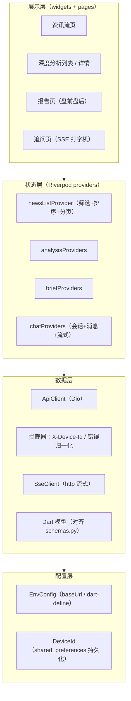
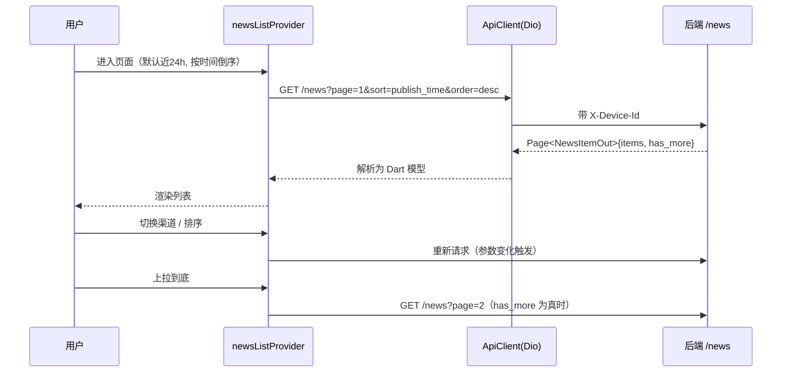
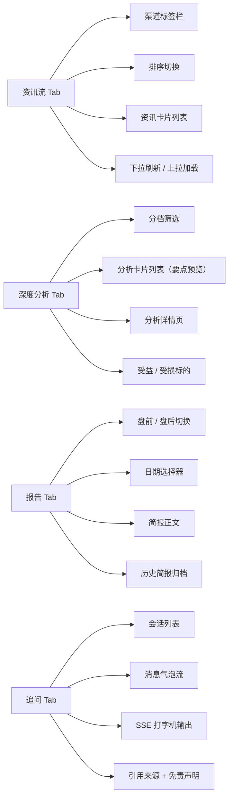

## 产品概述

为 fin-news 增加 Flutter 移动端 App，定位为**消费端**：把已有的资讯、深度分析、盘前盘后报告、AI 追问能力搬到手机上，让用户随时随地查看市场解读。

> **首版聚焦 iOS**（用户最新明确要求）。代码仍保持跨平台结构（不写任何平台专属分支），
> 但本轮只配置与验证 iOS：`ios/` 工程、ATS、iOS 模拟器与真机运行。`android/` 由
> `flutter create` 一并生成但不做适配与打包，后续补 Android 时接近零成本。

**环境已确认**：Flutter 3.44.9（stable，fvm 管理）、Xcode 26.6、iOS 模拟器可用（iPhone 17 Pro 等）。

**设计语言**：维持 Material 3（与 Web 端深色专业金融风格的语义色板一致），原因是后续还要
覆盖 Android，避免 UI 层返工；在 iOS 上仅做必要的平台适配（安全区、iOS 风格滚动物理、
返回手势、日期选择器用 Cupertino 风格以贴合 iOS 习惯）。

## 核心功能

**一、资讯流**

- 渠道筛选：顶部横向标签（财联社 / 华尔街见闻 / 第一财经），数据来自渠道聚合接口，标签上带各渠道条数
- 排序切换：按发布时间 / 评分 / 重要程度，支持正序倒序
- 列表分页：下拉刷新 + 上拉加载更多；卡片展示标题、摘要、来源、时间、评分分档标签
- 已分析的资讯在卡片上显示分析摘要，点击可进入详情

**二、深度分析**

- 列表：展示评分 3 分以上、AI 已做详细分析的内容，含要点预览（bullets）
- 详情：完整分析报告（受益/受损标的、实体、影响等级、置信度、参考来源）

**三、盘前盘后报告**

- 盘前 / 盘后切换，日期选择器，查看指定交易日简报
- 历史简报归档列表，可回溯往期

**四、追问（AI 对话）**

- 会话列表、新建/删除会话、消息历史
- SSE 流式输出，逐字打字机效果
- 流式结束后展示引用来源与免责声明

## 范围约束

- **不做运维功能**：补数、重算评分、重跑分析、死信重放等 admin 能力留在 Web 端与 CLI
- **不做评估集**：人工标注偏生产力工具，手机上体验不佳
- 首版不做个股详情与语义检索（后续迭代）
- **首版只交付 iOS**：Android 不配置签名、不打包、不验证（仅保留 `flutter create` 生成的骨架）
- 不改动 Python 后端代码

## 技术栈选型

| 层 | 选型 | 理由 |
| --- | --- | --- |
| 框架 | **Flutter**（Dart 3） | 用户指定；一套代码覆盖 iOS/Android |
| 状态管理 | **Riverpod**（flutter_riverpod） | 用户指定；编译期安全、易测试，与 Dio 配合自然 |
| 网络 | **Dio** | 用户指定；拦截器便于统一注入 `X-Device-Id` 与错误归一化 |
| 本地存储 | shared_preferences | 持久化设备 ID、后端地址、主题偏好 |
| 序列化 | json_serializable + freezed | 模型不可变、自动生成 `fromJson`，与后端 Pydantic 契约对齐 |
| 流式 | http（StreamedResponse） | 追问 SSE 需要原始字节流，Dio 对 SSE 支持不如 http 直接 |
| 日期/国际化 | intl | 中文时间与数字格式化 |


## 实现方案

### 总体思路

在 monorepo 根新建 `mobile/`，与现有 `web/` 平级。App **不改动任何后端代码**，完全复用现有 REST API。核心是把 Web 端已验证的交互逻辑与数据契约平移到 Dart/Riverpod 技术栈。

### 分层架构



### 关键技术决策与权衡

| 决策 | 选择 | 权衡理由 |
| --- | --- | --- |
| Base URL | `--dart-define=API_BASE_URL=...` + 应用内可覆盖 | Android 模拟器需 `10.0.2.2`、iOS 模拟器 `localhost`、真机局域网 IP，硬编码必踩坑。开发期提供设置入口便于真机调试 |
| 设备 ID | 首次启动生成 UUID，存 shared_preferences，拦截器注入 | 后端 `deps.py` 已按 `X-Device-Id` 隔离会话，且注释写明"接入账号体系后替换为 Bearer JWT"——沿用即可平滑演进到登录态 |
| SSE 实现 | 用 `http` 而非 Dio | 需要逐块读取字节并即时渲染，http 的 `StreamedResponse.stream` 更直接 |
| 中文断字处理 | 自定义缓冲累积 + UTF-8 解码 | SSE 分片可能切断多字节汉字，直接解码会出现乱码，必须先累积缓冲再解码 |
| 模型生成 | 手写 + json_serializable 生成 | 契约字段已全部核实（见下），代码生成保证类型安全 |
| 追问降级 | 同时支持 `stream=true/false` | 后端两种模式都支持；流式为主，非流式作为弱网降级路径 |


### 已核实的后端契约（App 建模依据）

**通用约定**

- Base URL：`http://<host>:8000/api/v1`（App 必须绝对地址，Web 用的是相对路径）
- 认证：无（MVP 匿名），靠 `X-Device-Id` 头隔离
- 错误：非 2xx 返回 `{"detail": "..."}`；204 无 body
- 分页：统一 `Page[T]` = `{page, page_size, total, has_more, items}`，入参 `page` / `page_size`

**核心模型字段**（源自 `src/fin_news/api/schemas.py`）

```text
NewsItemOut      id, title, summary, source, src, src_name, kind, channels,
                 publish_time, ingested_at, score, band, score_reason, tags,
                 entities[], has_analysis, analysis_summary, analysis_id, seen_count
NewsSourceOut    src, src_name, count                 ← 渠道标签与其条数
NewsDetailOut    NewsItemOut + content, content_truncated, url, score_history[], related_news[]
DeepAnalysisOut  id, agent_type, news_id, news_title, news_source, news_publish_time,
                 title, summary, score, band, sentiment, impact_level, horizon,
                 confidence, beneficiaries[], victims[], entities[], bullets[],
                 published_at, disclaimer
AnalysisDetailOut AnalysisReportOut + content{}, external_sources[], run{}
                 （AnalysisReportOut 含 status / model / prompt_version / references[] 等）
ChatSessionOut / ChatMessageOut / BriefMetaOut / HealthOut
```

**SSE 事件格式**（`chat.py:176-216`，必须严格按此解析）

```text
event: delta       data: {"text": "逐字片段"}
event: references  data: {"items": [...]}     ← 注意：流结束后才发，不在 delta 之前
event: done        data: {"message_id": "...", "model": "...", "latency_ms": ...}
event: error       data: {"detail": "..."}
```

### 实现要点（防止踩坑）

1. **`/news` 默认只返回近 24 小时**（`news.py:141` 的 `default_since`）。做"加载更早资讯"时必须显式传 `start`/`end`，否则用户会以为没有更多数据。
2. **`references` 在流结束后才发出**，UI 不能在收到首个 delta 时就期待引用列表，应等 `done` 后再渲染引用区。
3. **iOS ATS**：真机用 HTTP 明文调试需在 `Info.plist` 配置 `NSAllowsArbitraryLoads`；生产环境应走 HTTPS。
4. **Android 网络权限**：`AndroidManifest.xml` 需 `INTERNET` 权限。
5. **分页终止条件**用 `has_more`，不要靠 `items.length == page_size` 推断（最后一页可能正好满页）。
6. **不要接入任何 `/admin` 路由**（用户明确不做运维功能）。

## 实现备注

- **性能**：列表用 `ListView.builder` 懒加载；图片资源本期基本没有（纯文本资讯），首屏压力小。追问流式渲染要避免每收到一个字就 `setState` 整棵树，只更新消息气泡组件。
- **错误与空态**：统一 Dio 拦截器把异常转成中文提示（网络不可达 / 服务异常 / 数据为空），每个页面都要有加载中、错误重试、空数据三态。
- **日志**：开发期用 `debugPrint`，不引入重型日志库；不要把设备 ID 或接口内容打到生产日志。
- **blast radius**：全部为新增目录 `mobile/`，零改动 Python 后端与 Web 前端，互不影响。

## 架构设计

### 目录结构

```
mobile/
├── lib/
│   ├── main.dart                    # 入口：ProviderScope + 主题 + 路由
│   ├── app.dart
│   ├── config/
│   │   └── env.dart                 # [NEW] baseUrl（dart-define / 本地覆盖）、环境常量
│   ├── core/
│   │   ├── api_client.dart          # [NEW] Dio 封装：baseUrl、超时、拦截器、错误归一化
│   │   ├── api_exception.dart       # [NEW] 统一异常类型（含中文提示）
│   │   ├── sse_client.dart          # [NEW] SSE 解析：event/data 分块 + UTF-8 安全解码
│   │   └── device_id.dart           # [NEW] UUID 生成 + shared_preferences 持久化
│   ├── models/                      # [NEW] 对齐 schemas.py 的 Dart 模型
│   │   ├── page.dart                # Page<T> 泛型分页
│   │   ├── news.dart                # NewsItemOut / NewsSourceOut / NewsDetailOut
│   │   ├── analysis.dart            # DeepAnalysisOut / AnalysisDetailOut
│   │   ├── market.dart              # BriefMetaOut / PrePostMarketBrief
│   │   └── chat.dart                # ChatSessionOut / ChatMessageOut
│   ├── providers/                   # [NEW] Riverpod 状态层
│   │   ├── news_providers.dart      # 资讯流（筛选/排序/分页/刷新）
│   │   ├── analysis_providers.dart  # 深度分析列表与详情
│   │   ├── market_providers.dart    # 盘前盘后 + 历史简报
│   │   └── chat_providers.dart      # 会话 + 消息 + 流式发送
│   ├── pages/                       # [NEW] 四个主页面
│   │   ├── news_feed_page.dart
│   │   ├── analysis_page.dart
│   │   ├── analysis_detail_page.dart
│   │   ├── reports_page.dart
│   │   └── chat_page.dart
│   ├── widgets/                     # [NEW] 复用组件
│   │   ├── news_card.dart           # 资讯卡片（含分档标签、分析摘要）
│   │   ├── band_chip.dart           # 评分分档色标
│   │   ├── source_filter_bar.dart   # 渠道横向标签（带计数）
│   │   ├── empty_view.dart          # 空态 / 错误 / 加载三态
│   │   └── chat_bubble.dart         # 消息气泡（含打字机光标）
│   └── theme/
│       └── app_theme.dart           # [NEW] Material 3 主题（明暗 + 涨跌色 + 分档色）
├── test/                            # [NEW] 模型解析 / SSE 解析 / provider 单测 + widget 测试
├── android/ ios/                    # 平台工程（含 ATS / INTERNET 权限配置）
├── pubspec.yaml
└── README.md                        # [NEW] 运行、配置后端地址、打包说明
```

### 数据流（以资讯流为例）



## 关键代码结构

**1) 统一错误与 Dio 拦截器（网络层基石）**

```
class ApiException implements Exception {
  final int? status;
  final String message;      // 已转为中文提示，可直接展示
  const ApiException(this.message, {this.status});
}

// 拦截器职责：注入 X-Device-Id；非 2xx 解析 {"detail": ...} 抛 ApiException；
// 网络不通/超时统一转为中文提示；204 返回 null
class ApiClient {
  ApiClient({required String baseUrl, required Future<String> deviceId});
  Future<T?> get<T>(String path, {Map<String, dynamic>? query});
  Future<T?> post<T>(String path, {Object? body});
  Future<void> delete(String path);
}
```

**2) SSE 解析（追问流式的核心，需 UTF-8 安全）**

```
/// 按 SSE 规范解析事件；返回 (event, data) 流。
/// 关键点：网络分片可能切断多字节汉字，必须先累积到完整事件块再解码，
/// 否则中文会出现乱码。
Stream<SseEvent> parseSse(Stream<List<int>> byteStream);

class SseEvent {
  final String event;   // delta / references / done / error
  final Map<String, dynamic> data;
}
```

**3) 分页模型（与后端 Page[T] 严格对齐）**

```
@JsonSerializable(genericArgumentFactories: true)
class Page<T> {
  final int page, pageSize, total;
  final bool hasMore;      // 分页终止必须用这个字段
  final List<T> items;
}
```

## 设计风格

金融资讯类移动应用，关键词：**专业可信、信息密度高、长时间阅读友好、即时反馈**。

- **主题**：Material 3，默认深色（金融场景长时间盯盘/阅读，深色更省眼且显专业），同时提供浅色切换。深浅两套共用同一套语义色板。
- **视觉语言**：卡片式列表 + 圆角容器 + 克制的分隔线；避免使用大面积高饱和色块，颜色只用于传达**涨跌**与**评分分档**这类有语义的信息。
- **动效**：SSE 逐字输出要有打字机光标；列表加载用骨架屏而非转圈；页面切换用标准 Material 转场即可，不过度设计。

## 应用类型

APP（移动应用）。**首版按 iOS 平台规范落地**：底部导航栏（Material NavigationBar）、顶部 AppBar、
`SafeArea` 处理刘海屏与底部 Home 指示条、支持 iOS 侧滑返回手势、滚动物理用 iOS 的
`BouncingScrollPhysics`、日期选择用 `showCupertinoModalPopup` + `CupertinoDatePicker`
（贴合 iOS 用户习惯）。Android 规范（如 `ClampingScrollPhysics`、返回键拦截）本轮不做。

## 页面规划



### 1. 资讯流页（默认页，底部导航第一项）

- **渠道标签栏**：横向可滚动 chips，默认「全部」，其后为财联社 / 华尔街见闻 / 第一财经，每个标签右上角显示该渠道条数（来自渠道聚合接口）
- **排序切换**：右上角图标切换「最新 / 评分 / 重要程度」，再次点击切换升降序
- **资讯卡片列表**：来源名 + 时间（次要文字）／标题（主文字，最多两行）／摘要（两行截断）／底部一行：评分分档色标 + 已分析标记
- **交互**：下拉刷新、上拉加载更多、点击进详情；已分析资讯在卡片底部显示一行分析摘要预览

### 2. 深度分析页

- **分档筛选**：顶部按 NOISE / STOCK / INDUSTRY / MACRO 过滤，默认展示有意义的分档
- **分析卡片列表**：报告标题 + 关联资讯来源 + 发布时间 + 评分分档 + 要点（bullets）预览前两条
- **分析详情页**：标题、摘要、完整正文、受益标的（红）/ 受损标的（绿）、影响等级与置信度、参考来源、底部固定免责声明
- **空态**：暂无深度分析时给出说明文案与刷新入口

### 3. 报告页

- **时段切换**：顶部两个 Tab（盘前展望 / 盘后复盘）
- **日期选择器**：点击标题栏日期弹出选择器，可查看指定交易日
- **简报正文**：结构化展示结论、要点、关注方向；非交易日显示「非交易日，无简报」空态
- **历史归档**：底部折叠区域或入口，列出近期简报（BriefMetaOut 列表），点击进入对应日期

### 4. 追问页

- **会话列表**：按最近消息时间倒序，显示标题（或首条问题摘要）、消息数、最后时间，支持左滑删除、右下角新建
- **聊天界面**：用户消息右对齐、AI 消息左对齐；AI 回复流式渲染，末尾带闪烁光标表示生成中
- **引用区**：流结束后（`done` 事件）在消息下方展示引用来源列表
- **免责声明**：底部常驻一行小字「AI 生成，仅供参考，不构成投资建议。」
- **输入框**：多行自适应高度，发送按钮；生成中禁用发送并允许「停止」

### 通用组件（跨页复用）

- 底部导航栏：四项固定 Tab，选中态用主色高亮
- 三态容器：加载骨架屏 / 错误重试 / 空数据插图，四个页面统一使用
- 分档色标（BandChip）：四个分档固定配色，全 App 一致

## 可访问性

- 正文对比度满足 WCAG AA；涨跌不**仅**靠颜色区分，配「+/-」符号
- 可点击元素最小触控区 44×44
- 支持系统字体缩放

## Agent Extensions

### SubAgent

- **code-explorer**
- Purpose: 在实施前精读 `src/fin_news/api/schemas.py` 中尚未逐字段确认的模型（`BriefMetaOut`、`PreMarketBriefOut`、`PostMarketBriefOut`、`ChatSessionOut`、`ChatMessageOut`、`MarketOverviewOut`）以及各列表接口的精确查询参数，保证 Dart 模型与分页/筛选参数与后端契约**逐字段一致**
- Expected outcome: 输出完整的字段清单与参数约束（含可选性、默认值、枚举取值），供 json_serializable 建模与各 provider 构造请求参数时直接引用，避免联调阶段才发现字段不匹配