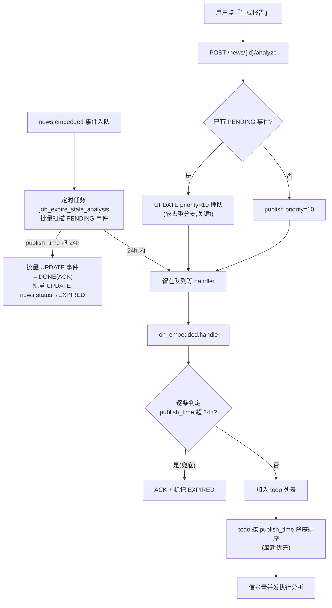
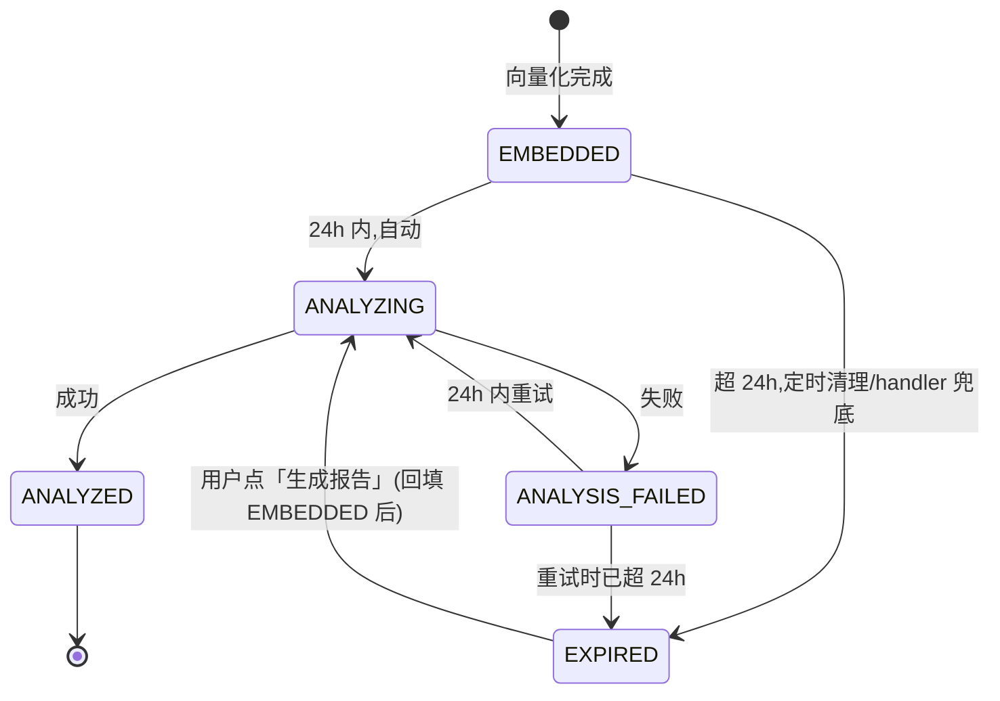
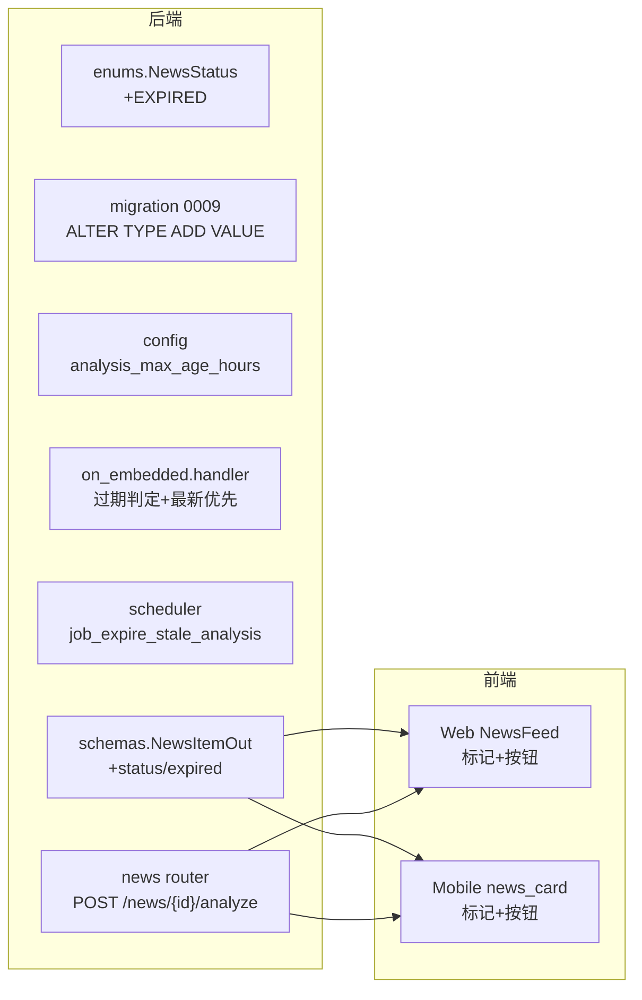

## 产品概述

调整深度分析的**时效策略**，让有限的 AI 分析产能集中服务有新闻价值的内容，把「永远排队的历史旧闻」从自动链路中摘出，改为用户按需触发。

核心变化：系统不再试图分析所有 `score > 3` 的资讯，而是**只自动分析 24 小时内发布的新闻**；超期资讯被标记为新状态 `EXPIRED`，其分析事件由定时任务批量确认（ACK），不再占用队列；用户在 Web / Mobile 上对任意未生成报告的资讯点「生成报告」即可高优先级插队、近实时产出。

## 核心特性

**一、时效感知的自动分析**

- 以资讯发布时间 `publish_time` 为基准，`analysis_max_age_hours`（默认 24）小时内才自动进入深度分析
- 超期事件在 handler 内兜底：直接 ACK 并把资讯标记为 `EXPIRED`
- 新增 `EXPIRED` 新闻状态，与既有状态机并存

**二、定时任务批量清理积压**

- 新增调度任务，周期性扫描 PENDING 的 `news.embedded` 事件，把超期部分批量 ACK 并批量标记 `EXPIRED`
- 一次性释放历史积压（当前 3834 个 PENDING 事件中大量是过期旧闻），避免 handler 逐个判定的开销

**三、最新优先的处理顺序**

- 一批待分析资讯按 `publish_time` 降序执行，保证新的新闻先出报告

**四、用户手动触发（近实时）**

- Web / Mobile 对未生成报告的资讯提供「生成报告」按钮
- 手动任务通过提升事件优先级插队，下一个 poll 周期（≤2 秒）即开始，复用队列的重试/死信机制
- 手动触发**不受 24 小时限制**，过期资讯同样可触发；支持强制重跑已有报告

**五、过期资讯可见、可恢复**

- 过期资讯在列表中正常展示，带「已过期」标记，不隐藏不降权
- 随时可手动触发分析，触发后回到正常链路

## 范围约束

- 不改评分、向量化链路
- 不做告警、不做前端大改版，聚焦时效策略与手动触发闭环
- Web 与 Mobile 行为保持一致（同一 API 契约与交互语义）

## 技术栈选型

沿用现有技术栈，零新组件：

| 层 | 选型 | 说明 |
| --- | --- | --- |
| 后端 | FastAPI + SQLAlchemy 2.0 async + PostgreSQL | 复用现有事件总线与 pipeline |
| 调度 | APScheduler（现有 `ingestion/scheduler.py`） | 新增一个清理 job，沿用 `coalesce=True / max_instances=1` |
| 迁移 | Alembic | 首次给 PG enum 加值，需特殊处理 |
| Web | React + TypeScript（现有 `web/src`） | 复用 `api/client.ts` 的 `api.post()` |
| Mobile | Flutter + Riverpod（现有 `mobile/lib`） | 复用 `api_providers` 与既有卡片组件 |


## 实现方案

### 总体思路

在**三个位置**协同实现时效策略，而不是单点判断：



三处职责划分：

1. **定时清理（主）**：批量、高效，解决存量积压
2. **handler 兜底**：处理「入队后、清理前」刚好过期的边界，保证语义严谨
3. **手动触发**：不受时效限制，高优先级插队

### 关键设计决策与权衡

| 决策 | 选择 | 理由 |
| --- | --- | --- |
| 过期基准 | `publish_time` | 用户确认。符合新闻时效性直觉；该字段 `nullable=False` 且已有降序索引 `idx_news_publish_desc`，判断与排序都无需新索引 |
| 自动 vs 手动的边界 | 24h 内自动，超期转手动 | 把产能留给有决策价值的新新闻；旧闻用户想看时按需生成，成本可控 |
| 清理方式 | 定时批量 SQL 为主，handler 逐条兜底 | 批量 UPDATE 一条 SQL 清掉上千条积压，远比 worker 逐条拉取-判定-ACK 快；handler 兜底保证刚过期的情况不遗漏 |
| 手动触发实现 | 提升 priority 插队（不改队列机制） | 用户确认。`poll()` 已按 `priority DESC, created_at` 排序，提 priority 即插队；保留重试/死信/可观测，改动最小 |
| 手动是否受 24h 限制 | 不受限 | 用户显式要求，应无条件执行 |
| 已有报告能否强制重跑 | 事件 payload 带 `force` 标记 | 全局 `analysis_skip_existing` 无法满足 per-request 需求，`force` 让手动触发可绕过「已有报告跳过」 |
| EXPIRED 后状态回填 | 触发时改回 `EMBEDDED` | 让资讯重新满足 handler 的查询条件（`status IN (EMBEDDED, ANALYSIS_FAILED)`），逻辑复用而非特判 |
| enum 加值 | Alembic `autocommit_block()` | PG 的 `ALTER TYPE ADD VALUE` 在同一事务内不能立即使用新值；本项目首次给 `news_status` 加值，必须用 autocommit 块，否则迁移失败 |


### 边界情况（必须处理）

1. **PROCESSING 事件不碰**：定时清理只扫 `status = PENDING`，避免干扰正在执行的分析（当前有 24 个 PROCESSING）
2. **`ANALYSIS_FAILED` 也受时效约束**：失败重试若超 24h，同样转 `EXPIRED` 等手动触发；handler 查询条件已包含 `ANALYSIS_FAILED`
3. **软去重是手动触发的最大障碍**：现有 `POST /admin/news/{id}/reanalyze` 在已有 PENDING 事件时，`publish()` 因 `ON CONFLICT DO NOTHING` 静默返回 None，接口仍返回 202——**用户点了按钮却毫无反应且无提示**。新接口必须先查已有事件，走「提升优先级」分支
4. **`publish_time` 时区**：该字段带时区（`+08:00`），比较时用 `now()`（`timeutil` 的 Asia/Shanghai now），不要与 UTC 混用
5. **幂等**：手动触发可重复点击，提升 priority 是幂等 UPDATE，不会灌水

### 实现备注（防回归要点）

1. **不要改动 `poll()` 的通用排序**：插队靠 priority 字段，不改排序逻辑，避免影响其他事件类型
2. **定时清理用批量 SQL**：形如 `UPDATE ingest_event SET status='DONE' ... WHERE id IN (SELECT ... FROM ingest_event JOIN news_item ...)`，一次搞定，不要逐条 `bus.ack()`
3. **handler 内标记 EXPIRED 后要 commit**：`news.status` 修改在外层 session，过滤循环结束后统一 `session.commit()`（现有代码第 140 行已有 commit 点）
4. **排序字段要带上 publish_time**：`todo` 目前是 `(event_id, news_id, agent)` 三元组，需扩展为四元组携带 `publish_time` 才能排序
5. **`_analyze_one` 解包要同步更新**：排序后 `for eid, nid, ag, _ in todo`
6. **前端需要新增契约字段**：现有 `NewsItemOut` **不含 status**（字段清单见下方），前端无法判断「已过期」，必须新增 `status` / `expired`
7. **blast radius**：仅新增状态值与接口，不改既有评分/向量化/分析逻辑；`analysis_max_age_hours=0` 可关闭时效策略（等同现状）

## 架构设计

### 状态流转



### 分层影响



## 目录结构

```
fin-news-v5/
├── src/fin_news/
│   ├── core/
│   │   ├── enums.py                 # [MODIFY] NewsStatus 新增 EXPIRED = "EXPIRED"
│   │   └── config.py                # [MODIFY] 新增 analysis_max_age_hours=24、
│   │                                #          expire_job_interval_minutes=30、manual_priority=10
│   ├── api/
│   │   ├── schemas.py               # [MODIFY] NewsItemOut 新增 status / expired 字段
│   │   └── routers/
│   │       ├── news.py              # [MODIFY] 新增 POST /news/{news_id}/analyze（用户手动触发）
│   │       └── admin.py             # [MODIFY] reanalyze 复用新的插队逻辑（修掉静默失效）
│   ├── pipeline/handlers/
│   │   └── on_embedded.py           # [MODIFY] ①过期判定→ACK+标EXPIRED ②todo 携带 publish_time
│   │                                #          并按降序排序 ③force 标记绕过「已有报告跳过」
│   ├── ingestion/
│   │   └── scheduler.py             # [MODIFY] 新增 job_expire_stale_analysis 定时清理
│   └── services/                    # [NEW] （可选）expire_service.py 承载批量清理 SQL 与手动插队逻辑，
│                                    #        供 scheduler 与 router 共用，避免 SQL 散落
├── alembic/versions/
│   └── 2026_09_06_0009_news_status_expired.py  # [NEW] ALTER TYPE news_status ADD VALUE 'EXPIRED'
│                                               #       （autocommit_block 包裹）
├── web/src/
│   ├── api/types.ts                 # [MODIFY] NewsItem 类型同步 status / expired
│   ├── pages/NewsFeed.tsx           # [MODIFY] 卡片/详情：过期标记 + 「生成报告」按钮
│   └── components/                  # [MODIFY] 按需抽出 NewsActions 按钮组件
├── mobile/lib/
│   ├── models/news.dart             # [MODIFY] NewsItem 新增 status / isExpired
│   ├── providers/news_providers.dart # [MODIFY] 新增 triggerAnalysis(newsId)
│   ├── widgets/news_card.dart       # [MODIFY] 加「已过期」标记
│   └── pages/news_feed_page.dart    # [MODIFY] 无报告时由纯提示改为「生成报告」按钮
└── tests/                           # [MODIFY] 过期判定 / 排序 / 插队 / 清理 SQL 的单测
```

## 关键代码结构

**1) 手动触发的服务层逻辑（解决软去重失效）**

```python
# src/fin_news/services/expire_service.py
MANUAL_PRIORITY = 10

async def request_analysis(session, news_id: int, *, force: bool = False) -> dict:
    """请求分析某条资讯：已有待处理事件则提升优先级插队，否则发布高优先级事件。

    关键：EventBus.publish 有软去重（PENDING/PROCESSING 同 aggregate 会静默忽略），
    积压场景下直接 publish 会「点了没反应」，必须先查已有事件再决定 UPDATE 还是 INSERT。
    """
    # EXPIRED 回填为 EMBEDDED，使其重新满足 handler 的查询条件
    # 已有 PENDING/PROCESSING → UPDATE priority=MANUAL_PRIORITY, payload={'manual':True,'force':force}
    # 否则 → bus.publish(NEWS_EMBEDDED, news_id, priority=MANUAL_PRIORITY, payload={...})
    return {"news_id": news_id, "queued": True, "priority": MANUAL_PRIORITY, "force": force}

async def expire_stale_events(session, max_age_hours: int, limit: int = 2000) -> dict:
    """批量 ACK 超期的 PENDING 事件，并把对应资讯标记为 EXPIRED。

    只扫 PENDING（不碰 PROCESSING），用批量 SQL 而非逐条处理。
    """
    return {"events_acked": 0, "news_expired": 0}
```

**2) handler 内的过期判定与最新优先（on_embedded.py）**

```python
# 过滤循环内，news.publish_time 与 now() 比较
if settings.analysis_max_age_hours > 0:
    age = now() - news.publish_time
    if age > timedelta(hours=settings.analysis_max_age_hours):
        news.status = NewsStatus.EXPIRED      # 外层 session，末尾统一 commit
        await bus.ack(event)
        expired += 1
        continue

# todo 携带 publish_time，便于排序
todo.append((event.id, news.id, agent_type.value, news.publish_time))

# 排序：最新优先（publish_time 降序）
todo.sort(key=lambda item: item[3], reverse=True)

# 并发时同步解包
results = await asyncio.gather(
    *(_analyze_one(eid, nid, ag) for eid, nid, ag, _ in todo),
    return_exceptions=True,
)
```

**3) 契约新增字段（schemas.py）**

```python
class NewsItemOut(_Base):
    # ... 现有字段保持不变 ...
    status: str | None = None      # 暴露资讯状态，前端据此判断 EXPIRED
    expired: bool = False          # 便捷布尔：status == EXPIRED
```

**4) 迁移（enum 加值，务必 autocommit）**

```python
def upgrade() -> None:
    with op.autocommit_block():   # PG: ALTER TYPE ADD VALUE 不能在同一事务内使用新值
        op.execute("ALTER TYPE news_status ADD VALUE IF NOT EXISTS 'EXPIRED'")
```

## 应用场景

Web（React）与 Mobile（Flutter）两个消费端，新增一致的时效交互元素。整体保持现有设计语言，不做改版。

## 新增 UI 元素

**1. 过期标记（Badge）**

- 位置：资讯卡片右上角（与「已分析」标记同一行）、详情页标题旁
- 样式：中性灰底 + 灰描边的小标签，文案「已过期」；不使用警示色，避免与评分分档色、涨跌色混淆（颜色在本项目只用于传达分档与涨跌语义）
- Web：复用现有 `band.ts` 的语义色 class 模式，新增 `expired` 对应样式
- Mobile：复用 `band_chip.dart` 的容器样式，新增 `ExpiredChip`

**2. 「生成报告」按钮**

- 位置：未生成报告（`!has_analysis`）的资讯——Web 在卡片底部与详情弹窗，Mobile 在卡片底部与详情页
- 样式：次级按钮（`OutlinedButton` / Flutter `OutlinedButton.icon`），文案「生成报告」，图标用「自动增强/分析」类图标与现有「已分析」标记呼应
- 交互：
- 点击后按钮进入 loading 态（禁用防重复点击）
- 请求返回 202 后提示「已加入队列，正在生成…」（不阻塞，因为分析需 1–6 分钟）
- 提供刷新入口：生成完成后用户下拉刷新即可看到报告；Mobile 可 toast 提示后自动刷新列表

**3. 过期资讯的呈现**

- 正常展示、不隐藏、不降权（用户已确认）
- 仅在卡片上多一个「已过期」标记 + 「生成报告」按钮，其余信息密度不变

## 交互一致性

- Web 与 Mobile 使用同一 API（`POST /news/{news_id}/analyze`）与同一套文案
- 两端都在 `has_analysis == false` 时展示按钮；`expired == true` 时额外展示标记
- 避免 emoji，文案统一用中文

## Agent Extensions

### SubAgent

- **code-explorer**
- Purpose: 实施前确认 `NewsItemOut` 的完整字段与 `_to_out()` 构造位置（用于新增 `status`/`expired`）、`on_embedded.py` 中 `now()`/`timeutil` 的既有引用方式、以及 `web/src/api/types.ts` 与 `mobile/lib/models/news.dart` 的类型同步点
- Expected outcome: 输出精确的字段清单与文件行号，保证后端契约新增字段、前端类型同步、handler 时区比较三处改法与现有约定一致，避免联调阶段才发现字段缺失或时区错用