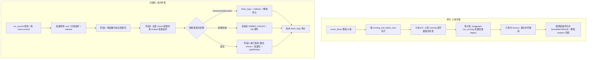

## 需求概述

评分（scoring）与向量化（embedding）链路处理速度过慢，用户要求**评分与 Embedding 两段都改为「小批量切分 + 受限并发」**：把一次整批 30 条的单次大模型调用改为若干小子批并行；把按资讯串行的逐条向量化改为整批 chunk 受限并发请求。目标是缩短单批墙钟时间、提升吞吐并有效消化积压，同时不改变入库结果、重试/失败隔离、维度校验终止等既有语义。

## 核心功能与验收点

- 评分：整批按小子批切分，子批间受限并发调用（默认 30 条 → 3×10 条并行），单批墙钟从「单次大调用生成时间」降至「最大子批耗时」
- 评分结果合并后与一次性大调用等价：编号映射正确、漏评/退化护栏仍按子批生效、跨子批同分集中的兜底 suspect 判定保留
- Embedding：一批资讯的全部 chunk 汇入受限并发池（进程级闸门），单批耗时从「逐条串行 × 单条内部小并发」变为「ceil(总 chunk 数 / 并发上限) × 单请求延迟」
- 每次 embedding 的审计日志从「一条一次」改为「攒批一次」写库，大幅减少数据库往返
- CLI 补数（embed / score）与事件驱动路径共享同一套小批并发逻辑，获得一致提速
- 单条失败仅影响该条（可重试、不中断批次）；向量维度异常仍整体终止防索引污染；检索/QA 的 embed_one 行为不变

## 技术选型

不改技术栈、不新增依赖：Python asyncio + httpx（Embedder 直连火山方舟 `/embeddings/multimodal`）+ SQLAlchemy 2.0 async + asyncpg/pgvector + LangGraph（评分图）+ 库内事件总线。火山多模态接口为单样本语义（一次请求只能得到一个向量），**只能逐条请求、靠并发提吞吐**，此正确性基础必须保留。

## 总体思路

### A. 评分侧：子批切分 + 受限并发（LangGraph / legacy 两条路径统一）

- 配置新增 `scoring_sub_batch_size: int = 10`；`scoring_concurrency=4` 从「仅保护单次调用」变为「子批并发上限」。
- `ScoringAgent.score_items()` 把整批 items（保持原有 publish_time 顺序）按小子批连续切片；每个子批独立重编号（现有 `_parse` 与评分图天然按「子批内顺序 = 1..k」映射，真实 news_id 在子批层映射回去，安全）。
- 每个子批执行体抽成 `_score_sub_batch(items)`：先 langgraph `run_scoring(sub)`，空/异常回退该子批 legacy，保留子批内 rescue（≤2 轮）与退化重试护栏；整批调用经 `get_semaphore("scoring")` 限流并发（默认 4 in-flight，30 条 → 3 子批全部并行）。
- 结果合并：按原始顺序展平为整批 `ScoreBatchResult`；`is_suspect` 采用「各子批 OR 合并 + 合并后整批按同阈值重算」双重兜底，防止跨子批同分集中被漏判；`model` 取首个非空、`latency_ms` 取各子批最大值（NewsScore 单值语义不冲突）；`prompt_tokens/completion_tokens` 累计。`_persist`、`_publish_scored_events`、`score_pending/score_news_by_id` 对外签名与行为不变。
- `score_dual_run`（默认关）保持整批一次 legacy 双跑对比的灰度能力，仅在开启时生效。

### B. Embedding 侧：整批 chunk 受限并发 + 审计攒批

- 配置新增 `embedding_concurrency: int = 16`（进程级 HTTP 闸门）；`embedding_batch_size` 保留兼容但标注弃用，不再被 `embed()` 使用；`limiter.py` embedding 槽位改读新配置，保证各引用方一致。
- `Embedder` 增加惰性 `asyncio.Semaphore`（挂进程级单例），`embed(texts, *, auto_flush=True)` 将全部文本放入受限并发池逐条请求（信号量包住 `_embed_one` 的 HTTP 调用），任何一条失败照旧抛错。
- 审计攒批：`_log_call` 改为追加进程内 pending 队列；`flush_logs()` 用一次 `session_scope()+add_all` 批量落库（`asyncio.Lock` 防并发重复 flush；失败仅 warning 与现状语义一致）；`embed()` 结束后按 `auto_flush` 决定是否 flush；`embed_one()`（检索/QA）内部 `auto_flush=True` 保持即时写；`close()` 兜底 flush；`DimensionMismatch` 传播前先 flush 防审计丢失。
- `on_scored.py` 重构为两段式批处理：批量预检 →（阶段 1）纯函数分块全部资讯（不占 DB 会话）→（阶段 2）整批受限并发 embedding（不占业务 session，统一 flush_logs 一次）→（阶段 3）按资讯串行落库（删旧 chunk、批量 add NewsChunk、置 EMBEDDED、publish/ack）。普通异常仅该条标 EMBED_FAILED + fail 事件；`DimensionMismatch` 整批回滚终止。
- 抽共享 helper（供事件驱动与 CLI 复用）：`chunk_news()` / `embed_news_batch()` / `build_chunk_rows()`；`vectorize_news(session, news, settings)` 保持对外签名兼容、内部委托 helper，避免破坏既有调用方与测试。

## 实施要点

- 并发 embedding 阶段**禁止 bind/unbind news_id**（logging contextvar 并发协程间会互相污染）；带 news_id 的日志统一放串行落库阶段输出。
- 编译后的 LangGraph 图按 key 缓存，各次 `ainvoke` 使用独立 state，无共享可变状态，可安全并发；若实现后测试发现共享状态问题，退化为「子批串行 await + 收集」仍优于整批一次大调用，需保留该兜底说明。
- `embed_news_batch()` 结果按资讯聚合（dict[news_id, vectors | 异常对象]），由调用方决定单条失败隔离或整体终止，保持维度校验在并发结果收集后统一执行。
- 检索/QA 路径（`retrieval.embed_query` → `embed_one`）不经过批处理，审计即时写，行为与现状一致。
- 评分并发上限按「进程数 × scoring_concurrency」与模型配额匹配；embedding 同理按「进程数 × embedding_concurrency ≤ 模型侧 QPS/配额」设定。
- 横向吞吐补充：事件总线 `FOR UPDATE SKIP LOCKED` 已支持多 worker 副本，建议起 2~4 副本并把 `db_pool_size` 调至 20~30（审计攒批后 DB 往返已大幅下降）。

## 架构与数据流



## 目录结构

```
src/fin_news/
├── core/config.py                        # [MODIFY] 新增 scoring_sub_batch_size=10、embedding_concurrency=16；
│                                         #   embedding_batch_size 注释标注弃用（保留 .env 兼容）
├── agents/scoring_agent.py               # [MODIFY] 抽 _score_sub_batch；score_items 改为子批切片 + 信号量并发 +
│                                         #   顺序合并（suspect 双重判定）；dual_run 灰度保留
├── agents/graphs/scoring_graph.py        # [MODIFY] 仅当需要支持并发安全说明/日志时微调；run_scoring 本身不变
├── agents/embeddings.py                  # [MODIFY] Embedder 增加信号量闸门 + pending 审计 + flush_logs/auto_flush/
│                                         #   close 兜底；embed() 改受限并发池；embed_one 保持即时写
├── agents/llm/limiter.py                 # [MODIFY] embedding 槽位改读 embedding_concurrency
├── pipeline/handlers/on_scored.py        # [MODIFY] 抽 chunk_news/embed_news_batch/build_chunk_rows 三个 helper；
│                                         #   handle() 改两段式批处理；vectorize_news 委托 helper 保持兼容
├── cli.py                                # [MODIFY] _cmd_embed 复用共享 helper（整批并发 embed 后逐条落库/commit）；
│                                         #   _cmd_score 经 score_items 自动获得小批并发
├── .env.example                          # [MODIFY] 增加 SCORING_SUB_BATCH_SIZE / EMBEDDING_CONCURRENCY 说明与调参指引
├── README.md                             # [MODIFY] 补充评分小批并发与 embedding 受限并发、审计攒批行为说明
├── docs/                                 # [MODIFY] 链路文档补充两段式批处理与运维调参（worker 副本、db_pool_size、
│                                         #   并发上限与模型配额/进程数关系）
└── tests/
    ├── test_embedding.py                 # [MODIFY] 适配日志攒批；新增闸门生效、flush_logs 批量写、维度校验仍终止
    ├── test_scoring_agent_parse.py       # [MODIFY] 新增子批切分 + 并发调用次数 = ceil(N/sub) 与合并一致性用例
    ├── test_scoring_graph.py             # [MODIFY] 若需验证编译图并发 ainvoke 安全（fake chat）
    ├── test_cli_commands.py              # [MODIFY] 适配 cli embed 新路径（若断言内部实现）
    └── test_config_settings.py           # [MODIFY] 覆盖新增配置默认值
```

## 关键代码结构（接口级约定）

```python
# core/config.py（新增字段）
scoring_sub_batch_size: int = 10   # 评分子批条数，与 scoring_concurrency 共同决定评分并行度
embedding_concurrency: int = 16    # embedding 请求进程级并发上限；embedding_batch_size 已弃用

# agents/embeddings.py
class Embedder:
    async def embed(self, texts: list[str], *, auto_flush: bool = True) -> list[list[float]]: ...
    async def embed_one(self, text: str) -> list[float]: ...          # auto_flush=True，检索/QA 路径不变
    async def flush_logs(self) -> None: ...                            # 一次 session_scope + add_all 批量写；asyncio.Lock 防并发
    async def close(self) -> None: ...                                 # 先 flush_logs 再关 httpx client

# agents/scoring_agent.py（内部结构）
async def _score_sub_batch(self, items: list[NewsItem]) -> ScoreBatchResult:
    """单子批：langgraph run_scoring 优先，空/异常回退该子批 legacy（子批内编号 1..k）。"""

# pipeline/handlers/on_scored.py（共享 helper，事件驱动与 CLI 复用）
def chunk_news(news: NewsItem, settings: Settings) -> list[str]: ...
async def embed_news_batch(
    items: list[tuple[NewsItem, list[str]]], settings: Settings
) -> dict[int, list[list[float]] | BaseException]: ...   # 整批受限并发，不占业务 session
def build_chunk_rows(news: NewsItem, chunks: list[str], vectors: list[list[float]],
                     settings: Settings) -> list[NewsChunk]: ...
async def vectorize_news(session: AsyncSession, news: NewsItem, settings: Settings) -> int:
    """保持对外签名兼容，内部委托 chunk_news / embed_news_batch / build_chunk_rows。"""
```

## Agent Extensions

### SubAgent

- **code-explorer**
- Purpose: 实施前全量复核 `Embedder.embed/embed_one/flush_logs`、`vectorize_news`、`score_items`、`run_scoring`、`get_semaphore` 等符号的全部调用点（事件 handler、CLI、检索/QA、LangChain 工具、测试断言），输出精确影响清单，防止小批并发改造破坏既有路径。
- Expected outcome: 一份包含「每个受影响文件/行/调用语义与对应测试文件」的影响面报告，供后续改造任务直接使用。