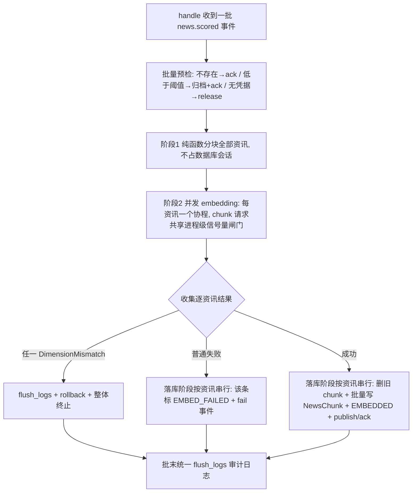

## 用户需求

用户反馈评分（scoring）与向量化（embedding）链路处理速度过慢，希望提高处理效率：加快批量资讯从「完成评分」到「完成向量化入库、可被检索/深度分析」的吞吐，缩短单批处理墙钟时间，并有效消化积压。

## 产品概述

本需求针对后端数据处理管线（无 UI）：高分资讯按序经历「分块 → 逐条调用多模态 embedding 接口 → 向量与分块入库 → 触发下游分析」。优化不得改变入库结果、单条失败重试语义、维度校验终止语义，也不得影响检索/问答等对向量服务的正常调用。

## 核心功能与验收点

- 一批资讯的向量化从「逐条排队串行」变为「整批受限并发」，显著缩短批处理耗时
- 提供可配置的并发上限（进程级闸门），避免超出模型服务配额与本地连接池
- 每次 embedding 的审计日志写入从「一条一次」合并为「一批一次」，消除大量数据库往返
- CLI 补数路径（embed）与事件驱动路径获得一致的提速
- 单条 embedding 失败仅影响该条资讯（可重试、不中断批次）；向量维度异常仍整体终止以防污染索引
- 检索/QA 路径（单条查询向量）不受闸门与日志改动影响

## 技术选型

不改技术栈，全部复用现有异步体系：Python asyncio + httpx（Embedder 直连火山方舟）+ SQLAlchemy 2.0 async + asyncpg/pgvector + 库内事件总线。不引入新依赖。

## 实现思路与关键决策

现状瓶颈（代码已确认）：

1. `pipeline/handlers/on_scored.py` 的 `handle()` 用 `for event in events: vectorize_news(...)` 逐条串行，一条资讯的 embedding 网络往返未结束就不处理下一条，批内并发窗口只有单条 chunk 数（3~15），总时延 ≈ Σ(单条分块 + embedding + DB 写入)；
2. `agents/embeddings.py` 的 gather 仅在单条 chunk 内并发，`embedding_batch_size=32` 对单条实际失效；`llm/limiter.py` 中已定义的 embedding 闸门未被使用；
3. `_log_call()` 每条 embedding 请求单独开一次 `session_scope()` 写 `llm_call_log`，N 个 chunk = N 次数据库往返，与主流程争抢连接池。

优化策略（两段式批处理 + 进程级并发闸门 + 审计攒批）：

- **保留火山接口「逐条请求」的正确性基础**（接口为单样本语义，无法在请求内做文本级 batch），只把并发窗口从「单条资讯」放大到「整批资讯」；
- **Embedder 增加进程级信号量**（新配置 `embedding_concurrency`，默认 16），`embed()` 不再按 batch 手工分批，而是把全部文本放入受限并发池；多个资讯的 embedding 协程共享同一信号量，全局并发精确受控；
- **审计日志攒批**：`_log_call` 只追加到进程内 pending 队列，`flush_logs()` 用一次 `session_scope()` + `add_all` 批量落库；`embed()` 结束按 `auto_flush` 决定是否写；批处理路径 `auto_flush=False`、批末统一 flush 一次；
- **on_scored / cli embed 共享同一批处理核心**：把 `vectorize_news` 拆为可复用的纯函数 helper（分块 / 并发 embedding / 构造 chunk 行），事件驱动与 CLI 在各自事务语义下复用，避免两套逻辑漂移；
- **错误隔离与安全语义保持不变**：并发 embedding 阶段不占用业务 session（纯网络 IO）；落库阶段按资讯串行（本地快速写）；普通异常仅将对应资讯标 `EMBED_FAILED` 并 fail 事件；`DimensionMismatch` 仍整批回滚终止（防向量索引污染）。

性能分析：改造后单批耗时由「逐条串行 × 单条内部小并发」变为 `ceil(批内总 chunk 数 / embedding_concurrency) × 单请求延迟`（另加一次批量审计写与一次批量 chunk 写）。审计写库从 O(chunk 数) 次往返降为 O(批数)，chunk 落库从每条 flush 合并为批内一次 flush/commit。时间复杂度上网络请求总数不变，但墙钟时间与数据库往返量级显著下降。

## 实施要点

- `get_embedder()` 为进程级单例，信号量与 pending 日志挂在其上即可进程内共享；多 worker 进程各自独立，需按「进程数 × embedding_concurrency ≤ 模型侧配额」设定配置。
- 并发 embedding 阶段**禁止 bind/unbind news_id**（logging contextvar 在并发协程间会互相污染）；带 news_id 的日志统一放到串行的落库阶段输出。
- `DimensionMismatch` 传播前先 `flush_logs()` 再 raise，保证异常路径审计不丢失；`Embedder.close()` 与 handler 的 `finally` 都做兜底 flush。
- `vectorize_news()` 保持对外签名与行为兼容（cli / 既有测试引用），内部委托新 helper，避免破坏现有调用方。
- `embedding_batch_size` 配置保留以兼容 `.env`，标注为已弃用（语义被 `embedding_concurrency` 取代），不再被 `embed()` 使用。
- 检索/QA 的 `embed_query()` → `embed_one()` 路径保持即时写审计（单条，量小），行为与现状一致。
- 评分侧吞吐不依赖本代码重构即可提升：多开 pipeline worker 副本（事件总线 `FOR UPDATE SKIP LOCKED` 已支持并发安全），并同步调大 `db_pool_size`（如 20~30）。

## 架构设计

改造后 `news.scored` 批处理流程：



## 目录结构

```
src/fin_news/
├── core/config.py                        # [MODIFY] 新增 embedding_concurrency: int = 16；
│                                         #   注释标注 embedding_batch_size 已弃用（保留兼容）
├── agents/embeddings.py                  # [MODIFY] Embedder 增加进程级信号量闸门与审计日志
│                                         #   攒批（pending + flush_logs + auto_flush）；
│                                         #   embed() 改为受限并发池；close() 兜底 flush；
│                                         #   embed_one 保持即时写审计
├── agents/llm/limiter.py                 # [MODIFY] embedding 角色的闸门值改读 embedding_concurrency，
│                                         #   保证所有引用方取值一致
├── pipeline/handlers/on_scored.py        # [MODIFY] 拆出 chunk_news / embed_news_batch /
│                                         #   build_chunk_rows 三个 helper；vectorize_news 委托它们保持兼容；
│                                         #   handle() 改为两段式批处理（预检→受限并发 embed→串行落库），
│                                         #   保留归档/ack/fail/publish 与维度终止语义
├── cli.py                                # [MODIFY] _cmd_embed 复用 embed_news_batch + build_chunk_rows，
│                                         #   去掉逐条串行向量化；保留逐条 begin_nested/commit 的事务可见性
├── .env.example                          # [MODIFY] 增加 EMBEDDING_CONCURRENCY 说明与调参指引
├── README.md                             # [MODIFY] 补充并发闸门与攒批审计的行为说明
├── docs/                                 # [MODIFY] 链路文档补充两段式批处理与运维调参（worker 副本数、
│                                         #   db_pool_size、并发上限与模型配额的关系）
└── tests/
    ├── test_embedding.py                 # [MODIFY] 适配日志攒批断言；新增闸门生效、flush_logs 批量写、
    │                                     #   维度校验仍终止的用例
    ├── test_cli_commands.py              # [MODIFY] 适配 cli embed 新路径（若断言内部实现）
    └── test_config_settings.py           # [MODIFY] 覆盖新增 embedding_concurrency 默认值
```

## 关键代码结构（接口级约定）

```python
# agents/embeddings.py
class Embedder:
    @property
    def _semaphore(self) -> asyncio.Semaphore:
        """进程级闸门，上限 settings.embedding_concurrency（惰性创建）。"""

    async def embed(self, texts: list[str], *, auto_flush: bool = True) -> list[list[float]]:
        """全部文本进受限并发池逐条请求；单条失败即抛；结束后按 auto_flush 决定是否 flush_logs。"""

    async def embed_one(self, text: str) -> list[float]:
        """单条向量（检索/QA 路径），内部 auto_flush=True，行为与现状一致。"""

    async def flush_logs(self) -> None:
        """一次 session_scope + add_all 批量写 pending 的 LLMCallLog；幂等；失败仅 warning。"""

    async def close(self) -> None:
        """先 flush_logs() 再关闭 httpx client。"""

# pipeline/handlers/on_scored.py（共享 helper，供事件驱动与 CLI 复用）
async def chunk_news(news: NewsItem, settings: Settings) -> list[str]: ...
async def embed_news_batch(
    items: list[tuple[NewsItem, list[str]]], settings: Settings
) -> dict[int, list[list[float]] | BaseException]:
    """整批受限并发 embedding（不占业务 session）；内部统一 flush_logs 一次。"""
def build_chunk_rows(news: NewsItem, chunks: list[str], vectors: list[list[float]],
                     settings: Settings) -> list[NewsChunk]: ...
async def vectorize_news(session: AsyncSession, news: NewsItem, settings: Settings) -> int:
    """保持对外签名兼容，内部委托 chunk_news / embed_news_batch / build_chunk_rows 实现。"""
```

## Agent Extensions

### SubAgent

- **code-explorer**
- Purpose: 实施前全量复核 `Embedder.embed / embed_one / vectorize_news / get_semaphore / flush` 等符号的全部调用点（事件 handler、CLI、检索、QA、测试断言），输出精确影响清单，防止改动破坏既有路径。
- Expected outcome: 一份包含「每个受影响文件/行/调用语义与对应测试」的影响面报告，供后续四个改造任务直接使用。