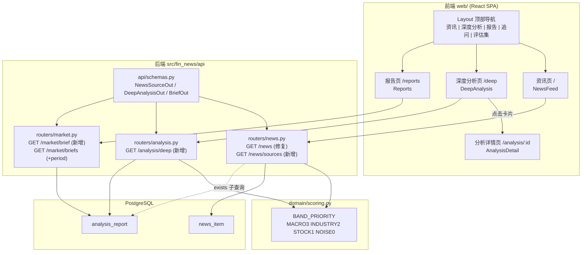

## 产品概述

将 fin-news-v5 的 Web 前端重构为三大板块，并配套改造后端接口。整体是一个「财经资讯 → AI 深度分析 → 盘前盘后报告」的递进式信息消费链路，用户既可在资讯流里快速扫读原始快讯，也可进入深度分析阅读 AI 的逻辑推演，还可按交易日回溯盘前盘后报告。

## 核心功能

### 一、原始资讯展示（顶层导航「资讯」，路由 `/`）

- **渠道分类**：顶部渠道标签栏按来源渠道（财联社、华尔街见闻、新浪财经等）分类切换，每个标签带该渠道的实时资讯条数；另有「全部」与「仅看已分析」两个固定标签。
- **页面展示**：标签栏内支持两种视图模式切换 —— 紧凑列表流（信息密度高，适合快速扫读）与卡片网格（含摘要与标签，适合慢读）；视图偏好本地记忆。
- **排序规则**：支持三种排序 —— 重要程度（宏观 > 行业 > 个股 > 噪声，同档内按评分、再按时间）、评分（1-10 分降序）、时间（发布时间倒序），并可叠加升降序与最低评分筛选（全部 / ≥4 / ≥6 / ≥8）和时间范围筛选。
- **分析摘要**：已做 AI 分析的资讯在卡片内以浅蓝底区块展示两行分析摘要，点击摘要或条目打开详情抽屉，抽屉内展示资讯原文、评分依据、评分历史、关联资讯，并可一键查看该条资讯的完整分析报告。
- 列表采用「加载更多」分页，首屏 30 条。

### 二、深度分析模块（顶层导航「深度分析」，路由 `/deep`）

- 汇聚**评分大于 3 且 AI 已完成详细分析**的内容（宏观政策 / 行业 / 个股三类 Agent 产出的报告），噪声档不进入。
- 卡片网格展示：评分徽章 + 分档标签、分析标题、原始资讯标题与来源时间、情绪（利好/利空/中性/多空交织）、影响程度（高/中/低）、影响周期（日内/短期/中期/长期）标签、三行摘要、核心要点列表、受益与受损标的标签。
- 支持按分析类型（宏观 / 行业 / 个股）、时间范围筛选，按最新 / 评分 / 重要程度排序。
- 点击卡片进入分析报告详情页 `/analysis/:id`，展示完整摘要、逻辑推演链条、核心要点、观察清单、风险提示、受益与受损标的明细、原始资讯出处。

### 三、盘前盘后报告板块（顶层导航「报告」，路由 `/reports`）

- 单一报告页，顶部标签切换「盘前展望 / 盘后复盘」。
- 日期选择器（含前一天 / 后一天快捷按钮）按交易日回溯任意一期简报。
- 正文区：盘前展示隔夜美股行情网格与今日关注方向列表；盘后展示一句话结论与市场状态标签、市场统计（涨跌家数 / 涨停跌停 / 成交额）、涨跌归因权重条形图、次日关注清单。
- 侧边历史归档列表按交易日分组展示近期简报，点击直接切换日期；所选日期无简报时显示友好空态而非报错。

### 兼容与保留

- 现有「追问」「评估集」「个股详情」页面与顶部个股搜索框保留；`/pre-market`、`/post-market` 旧路由重定向到 `/reports` 对应时段。

## 技术栈

沿用项目现有技术栈，不引入新依赖：

| 层 | 选型 | 说明 |
| --- | --- | --- |
| 后端 | FastAPI + SQLAlchemy 2.0(async) + asyncpg + PostgreSQL(pgvector) + Pydantic v2 | 路由层直接写 `select()`，项目无 `services/` `repositories/` 层 |
| 前端 | Vite 6 + React 18.3 + TypeScript 5.7(strict) + react-router-dom v6.28 + @tanstack/react-query v5 | **零 UI 依赖**，手写 div + CSS 变量 |
| 样式 | 手写 CSS（`web/src/index.css`，CSS 变量设计系统） | 不引入 Tailwind / 组件库 |
| 测试 | pytest（后端，现有 13 个测试文件）、`pnpm typecheck` + `pnpm build`（前端） | 现有测试无 API 路由覆盖 |


## 实现方案

### 总体策略

分两条线推进：**后端先补齐「数据契约」**（修复 `/news` 三处缺陷 + 新增 3 个接口），**前端再按三大板块重建页面**（导航 → 资讯页 → 深度分析页 → 报告页）。后端接口全部新增/修复，不删改现有契约；前端旧路由用重定向兜底，保证无破坏性变更。

### 关键技术决策

**决策 1：「重要程度」排序用 band 优先级，而非影响面加权**
`NewsItem` 上没有 `impact_level` 字段（该字段只在 `AnalysisReport` 上）。项目已有 `domain/scoring.py:16` 的 `BAND_PRIORITY = {MACRO:3, INDUSTRY:2, STOCK:1, NOISE:0}`，语义就是「重要程度」。因此 `sort=impact` 定义为 `band优先级 DESC → score DESC → publish_time DESC`，用 SQL `CASE` 表达式实现，直接复用 `BAND_PRIORITY` 常量构造，避免逻辑重复。这是最贴合现有领域模型的选择，无需新增字段。

**决策 2：`has_analysis` 从 Python 过滤改为 SQL `EXISTS` 子查询**
现有实现对 `has_analysis=True` 在分页后过滤（导致每页条数不足、`total` 偏大），`has_analysis=False` 是 no-op。改为 `exists(select(AnalysisReport.id).where(news_id == NewsItem.id, agent_type.in_(NEWS_AGENTS), status.in_(VISIBLE_STATUSES)))`。同时**不再依赖 `NewsItem.analysis_status` 字符串**（该字段仅在失败时写 `FAILED`，成功路径未见写入，不可靠），以 `AnalysisReport` 实表为唯一真实来源。

**决策 3：统一二级/三级排序键，消除 offset 分页抖动**
所有排序都追加 `publish_time DESC`（以及必要时的主键兜底），保证同一查询翻页时顺序稳定，不重复不漏数据。

**决策 4：新增接口用 `JOIN` 一次取回，避免 N+1**
现有 `analysis.py:103 _to_out` 对每条报告单独查 `NewsItem`（N+1）。新的 `/analysis/deep` 用 `select(AnalysisReport, NewsItem).join(NewsItem, ...)` 一次性取回，count 用 `select(func.count()).select_from(AnalysisReport).join(...)`。

**决策 5：路由顺序 —— 静态路径必须定义在路径参数之前**
`/news/sources` 必须声明在 `/news/{news_id}` 之前，`/analysis/deep` 必须声明在 `/analysis/{report_id}` 之前，否则会被路径参数吞掉。这是本次改动最大的踩坑点。

**决策 6：报告详情新增 `/market/brief` 而非改造现有 404 行为**
现有 `/market/pre-market`、`/market/post-market` 无数据时抛 404（前端会看到错误框）。新增 `GET /market/brief?period=&date=` 返回统一包装 `BriefOut{available, trade_date, period, brief}`，无数据返回 `available=false` + 200。旧接口原样保留，零破坏。

**决策 7：不动数据模型**
用户已确认不加字段/索引、不出 Alembic 迁移。渠道 Tab 的 `GROUP BY NewsItem.src` 依赖已有 `idx_news_publish_desc`；深度分析列表依赖已有 `idx_report_type_time(agent_type, published_at)`。若后续数据量大，可再评估加 `(src, publish_time)` 复合索引，本次不做。

### 系统架构



### 数据流

**资讯页**：渠道 Tab 与列表共享同一组过滤参数（start / min_score / band / has_analysis）→ `/news/sources` 返回各渠道计数、`/news?src=&sort=&page=` 返回分页列表 → React Query 分别缓存（staleTime 60s / 30s）→ 点条目打开抽屉拉 `GET /news/{id}` → 点「查看完整分析」跳 `/analysis/{analysis_id}`。

**深度分析页**：`/analysis/deep?agent_type=&sort=&page=` 一次 JOIN 取回报告 + 原资讯 → 卡片网格渲染 → 点卡片进 `/analysis/:id` 拉 `GET /analysis/{id}`。

**报告页**：URL query `?period=pre_market&date=YYYY-MM-DD` 为唯一状态源 → `/market/brief?period=&date=` 取正文 + `/market/briefs?days=90&period=` 取归档 → 点归档条目改 `date` query 参数触发重新请求。

## 实现要点（执行细节）

### 后端

**`src/fin_news/api/schemas.py`（修改）** —— 新增三个响应模型：

```python
class NewsSourceOut(_Base):
    src: str | None = None
    src_name: str | None = None
    count: int = 0


class DeepAnalysisOut(_Base):
    id: str
    agent_type: str
    news_id: str | None = None
    news_title: str | None = None
    news_source: str | None = None
    news_publish_time: datetime | None = None
    title: str
    summary: str
    score: int | None = None
    band: str | None = None
    sentiment: str | None = None
    impact_level: str | None = None
    horizon: str | None = None
    confidence: float | None = None
    beneficiaries: list[ImpactTargetOut] = Field(default_factory=list)
    victims: list[ImpactTargetOut] = Field(default_factory=list)
    entities: list[dict[str, Any]] = Field(default_factory=list)
    bullets: list[str] = Field(default_factory=list)
    published_at: datetime | None = None
    disclaimer: str = "AI 生成，仅供参考，不构成投资建议。"


class BriefOut(_Base):
    available: bool
    trade_date: date | None = None
    period: str = ""
    brief: PreMarketBriefOut | PostMarketBriefOut | None = None
```

**`src/fin_news/api/routers/news.py`（修改）**

- 模块级常量（DRY，供 `list_news` 与 `_latest_analysis` 共用）：

```python
_NEWS_AGENTS = [AgentType.MACRO_POLICY, AgentType.INDUSTRY, AgentType.STOCK]
_VISIBLE_STATUS = [ReportStatus.PUBLISHED, ReportStatus.DEGRADED]
```

- `list_news` 修复：
- `sort=impact` → `ORDER BY band_priority CASE DESC, score DESC NULLS LAST, publish_time DESC`
- `sort=score` → `ORDER BY score DESC NULLS LAST, publish_time DESC`
- `sort=publish_time` → `ORDER BY publish_time DESC`
- `has_analysis` 用 `exists()` / `~exists()` 下推到 `stmt` 与 `count_stmt`，**删除** news.py:92-93 的 Python 过滤
- 排序键用 `nullslast()`（PostgreSQL 原生支持）
- 新增 `/news/sources`（**必须声明在 `/news/{news_id}` 之前**）：`select(NewsItem.src, NewsItem.src_name, func.count()).where(...).where(NewsItem.src.is_not(None)).group_by(...).order_by(func.count().desc())`，过滤参数与 `list_news` 对齐（start / end / min_score / band）
- `NewsItemOut.summary` 截断补省略号（news.py:244）

**`src/fin_news/api/routers/analysis.py`（修改）**

- 新增 `/analysis/deep`（**必须声明在 `/analysis/{report_id}` 之前**）：
- 过滤：`agent_type.in_(_NEWS_AGENTS)` + `news_id.is_not(None)` + `status.in_(_VISIBLE_STATUS)` + `score >= min_score`（`min_score` 默认 **4**，语义即「评分 > 3」）
- 可选：`agent_type`（多值）、`band`、`start`、`end`、`sort`（published_at / score / impact）
- JOIN `NewsItem` 一次取回，`bullets` 从 `report.content.get("bullets")` 取前 3 条
- 返回 `Page[DeepAnalysisOut]`

**`src/fin_news/api/routers/market.py`（修改）**

- `/market/briefs` 增加 `period: MarketPeriod | None` 过滤参数（现有 `BriefMetaOut` 已含 period 字段，前端据此分组）
- 新增 `/market/brief?period=&date=`，复用现有 `_brief_base` + `PreMarketBriefOut` / `PostMarketBriefOut` 组装，无数据返回 `BriefOut(available=False, ...)`

### 前端

**通用约束**

- TS 开着 `noUnusedLocals` / `noUnusedParameters`，所有新增变量必须被使用；`pnpm typecheck` 必须零错误
- 不引入任何新依赖，样式全部追加到 `web/src/index.css`
- 颜色沿用现有 CSS 变量，红涨绿跌（`--up #dc2626` / `--down #16a34a`），分档色 `--band-macro #7c3aed` / `--band-industry #2563eb` / `--band-stock #0891b2` / `--band-noise #9ca3af`
- React Query 现状：`staleTime 30_000, retry 1, refetchOnWindowFocus false`；渠道聚合这类低频数据设 `staleTime: 60_000`

**性能要点**

- 资讯列表 `page_size` 从现有 50 降到 **30** + 「加载更多」，减少首屏 payload
- 渠道计数与资讯列表是两个 query，避免为拿计数而全量拉取列表
- 深度分析列表禁止沿用 `analysis.py` 式逐条查 `NewsItem` 的写法，前端也不要对每条卡片单独发 `/analysis/{id}` 请求 —— 列表接口已内联摘要与要点，详情只在进入 `/analysis/:id` 时拉取

**易错点**

- `/news/sources` 与 `/analysis/deep` 的路由顺序（见后端决策 5）
- `NewsItem.src` 可能为 `null`，前端渠道 Tab 与 `src_name` 回退链保持 `src_name || src || source`
- 报告页的 `date` query 参数是唯一状态源，切换 period 时若新 period 无该日期简报，`available=false` 显示空态，不要抛错

## 目录结构

```
src/fin_news/api/
├── schemas.py                      # [MODIFY] 新增 NewsSourceOut（渠道聚合项：src/src_name/count）、
│                                   #          DeepAnalysisOut（深度分析列表项：报告字段 + news_title/news_source/
│                                   #          news_publish_time + bullets 预览 + disclaimer）、
│                                   #          BriefOut（统一简报包装：available/trade_date/period/brief）
└── routers/
    ├── news.py                     # [MODIFY] ①list_news 修复：sort=impact 改为 band 优先级 CASE 排序
                                    #          （复用 domain.scoring.BAND_PRIORITY）、sort=score 改用 nullslast、
                                    #          所有排序追加 publish_time 二级键；②has_analysis 由 Python 过滤改为
                                    #          exists() 子查询下推（True/False 双向生效）；③summary 截断补省略号；
                                    #          ④新增 GET /news/sources 渠道聚合（须声明在 /news/{news_id} 之前）；
                                    #          ⑤抽出 _NEWS_AGENTS / _VISIBLE_STATUS 常量供 _latest_analysis 复用
    ├── analysis.py                 # [MODIFY] 新增 GET /analysis/deep 深度分析列表（须声明在
                                    #          /analysis/{report_id} 之前）：过滤 agent_type ∈
                                    #          {macro_policy,industry,stock} + news_id 非空 + status ∈
                                    #          {PUBLISHED,DEGRADED} + score >= min_score(默认 4)；支持
                                    #          agent_type/band/start/end/sort 与分页；JOIN NewsItem 一次取回避免
                                    #          N+1；bullets 取 content.bullets 前 3 条
    └── market.py                   # [MODIFY] ①GET /market/briefs 增加 period 过滤参数；②新增 GET
                                    #          /market/brief?period=&date= 返回 BriefOut，无数据返回
                                    #          available=false 而非 404，复用现有 _brief_base 组装

web/src/
├── api/
│   └── types.ts                    # [MODIFY] 新增 NewsSource、DeepAnalysisItem、BriefMeta、BriefResponse<T>；
│                                   #          为 NewsItem 补齐 channels/kind/ingested_at/url 可选字段
├── lib/
│   └── band.ts                     # [MODIFY] 新增 sentimentLabel（利好/利空/中性/多空交织）、impactLabel
│                                   #          （高/中/低）、horizonLabel（日内/短期/中期/长期）、agentLabel
│                                   #          （宏观/行业/个股）、fmtDate、clampText
├── index.css                       # [MODIFY] 追加组件样式：.tabs/.tab/.tab.active（渠道与时段标签栏）、
│                                   #          .view-toggle（列表/卡片切换按钮组）、.chip 及 .chip-positive/
│                                   #          .chip-negative/.chip-neutral 等语义色、.clamp-2/.clamp-3
│                                   #          （多行截断）、.drawer-mask/.drawer/.drawer-head（右侧抽屉）、
│                                   #          .news-card/.card-grid（卡片视图）、.analysis-card、
│                                   #          .archive/.archive-date（报告归档）、.load-more
├── App.tsx                         # [MODIFY] 路由表：/ → NewsFeed；新增 /deep → DeepAnalysis、
│                                   #          /analysis/:id → AnalysisDetail、/reports → Reports；
│                                   #          /pre-market、/post-market 改为重定向到 /reports?period=…
├── components/
│   ├── Layout.tsx                  # [MODIFY] 顶部导航改为「资讯 | 深度分析 | 报告 | 追问 | 评估集」，
│                                   #          保留个股搜索框
│   ├── ChannelTabs.tsx             # [NEW] 渠道标签栏：渲染「全部(N)/仅看已分析」+ 各渠道(src_name + count)，
│                                   #          横向滚动、选中高亮、数据来自 /news/sources
│   ├── NewsCard.tsx                # [NEW] 资讯条目，支持 view='list' | 'card' 两种形态；含 ScoreBadge、
│                                   #          BandTag、来源与时间 meta、评分依据、分析摘要区块（浅蓝底
│                                   #          .news-reason + 两行截断 + 「查看详情」）与点击回调
│   ├── NewsDrawer.tsx              # [NEW] 资讯详情抽屉：拉 /news/{id} 展示正文、评分依据、评分历史、
│                                   #          关联资讯；有分析时提供「查看完整分析」跳转 /analysis/{analysis_id}；
│                                   #          支持遮罩点击与 ESC 关闭
│   ├── AnalysisCard.tsx            # [NEW] 深度分析卡片：headline 标题、原资讯标题与来源时间、ScoreBadge +
│                                   #          BandTag、情绪/影响程度/周期 chip、三行摘要、要点列表、
│                                   #          受益与受损标的标签、查看详情链接
│   ├── PreMarketBrief.tsx          # [NEW] 从 pages/PreMarket.tsx 抽取的纯展示组件（接收 PreMarketBrief
│                                   #          数据）：标题摘要 + 隔夜美股网格 + 无行情权限降级提示 + 今日关注方向
│   ├── PostMarketBrief.tsx         # [NEW] 从 pages/PostMarket.tsx 抽取的纯展示组件：一句话结论与状态标签 +
│                                   #          市场统计网格 + 涨跌归因权重条形图 + 次日关注
│   └── BriefArchive.tsx            # [NEW] 报告历史归档：拉 /market/briefs?days=90&period=…，按 trade_date
│                                   #          分组的日期列表，点击回调切换日期
└── pages/
    ├── Timeline.tsx                # [DELETE] 由 NewsFeed.tsx 取代
    ├── NewsFeed.tsx                # [NEW] 资讯页（/）：市场概览卡 + ChannelTabs + 工具条（排序/评分/时间
                                    #          范围/视图切换/仅看已分析）+ 列表或卡片网格 + 加载更多 +
                                    #          NewsDrawer；视图偏好存 localStorage
    ├── DeepAnalysis.tsx            # [NEW] 深度分析页（/deep）：类型 Tab（全部/宏观/行业/个股）+ 排序与
                                    #          时间范围 + AnalysisCard 网格 + 加载更多 + Disclaimer
    ├── AnalysisDetail.tsx          # [NEW] 分析详情页（/analysis/:id）：完整摘要、逻辑推演链条 logic_chain、
                                    #          核心要点 bullets、观察清单 watch_list、风险提示 risks、
                                    #          受益与受损标的明细、原资讯出处卡片、Disclaimer
    ├── Reports.tsx                 # [NEW] 报告页（/reports）：时段 Tab（盘前/盘后）+ 日期选择器与前后日
                                    #          快捷按钮 + 正文（PreMarketBrief / PostMarketBrief）+ 侧边
                                    #          BriefArchive + 空态；状态由 URL query(period,date) 驱动
    ├── PreMarket.tsx               # [DELETE] 渲染逻辑抽到 components/PreMarketBrief.tsx，路由重定向
    └── PostMarket.tsx              # [DELETE] 渲染逻辑抽到 components/PostMarketBrief.tsx，路由重定向

tests/
├── test_news_api.py                # [NEW] 覆盖：sort=impact 按 band 优先级排序、sort=score nullslast、
│                                   #          二级排序稳定性、has_analysis True/False 双向过滤与 total 正确、
│                                   #          /news/sources 分组计数与过滤一致性
├── test_analysis_api.py            # [NEW] 覆盖：/analysis/deep 的 agent_type 白名单（排除盘前盘后）、
│                                   #          score>3 过滤、status 过滤、JOIN NewsItem 字段回填
└── test_market_brief_api.py        # [NEW] 覆盖：/market/brief 有数据返回 available=true、无数据返回
                                    #          available=false 且 200、/market/briefs 的 period 过滤
```

## 设计风格

延续项目现有的**浅色金融数据终端**视觉语言（CSS 变量体系已存在），在此基础上升级为「专业资讯终端 + 轻玻璃质感」：低饱和灰蓝底、纯白卡片、克制的蓝色强调色、严格遵循 A 股红涨绿跌约定。整体追求信息密度与克制的高级感，不做花哨装饰，靠**分档色彩系统、清晰的层级节奏与微交互**建立品质感。

- **质感**：卡片 1px 浅边框 + 12px 圆角 + 极浅投影；标签栏选中态用实心蓝胶囊，未选中为透明底灰字，hover 时淡灰底过渡（120ms）。
- **色彩语义化**：评分分档直接映射色彩 —— 宏观紫、行业蓝、个股青、噪声灰，用户在列表扫视时凭颜色即可判断资讯量级；分析摘要区块用淡蓝底（#eff6ff）与常规正文形成区分，暗示「这是 AI 产出」。
- **微交互**：卡片 hover 背景提亮 + 轻微上移；渠道标签、视图切换按钮、加载更多按钮均有 hover/active 过渡；抽屉从右侧滑入（220ms cubic-bezier），遮罩淡入；长文本统一用 `-webkit-line-clamp` 截断，保证列表高度可预期。
- **响应式**：桌面优先（容器 max-width 1080px 保持），卡片网格用 `auto-fill minmax(300px, 1fr)`；窄屏时双列转单列，抽屉改为接近全宽的右侧面板，报告页侧边归档从右栏移到正文下方。

## 页面规划

### 页面一：资讯（`/`）

1. **市场概览条**：交易日指数涨跌、涨跌家数、涨停数、成交额，沿用现有 `.grid` + `.stat` 网格，紧凑排布，作为全站情境锚点。
2. **渠道标签栏**：横向胶囊标签，「全部 / 仅看已分析」置前，其后按资讯量降序排列各渠道（财联社、华尔街见闻…），每个标签右侧带小号计数徽章；溢出时横向滚动。
3. **筛选与视图工具条**：排序下拉（重要程度 / 评分 / 时间）、评分下拉（全部 / ≥4 / ≥6 / ≥8）、时间范围（24 小时 / 3 天 / 7 天）、右侧「仅看已分析」开关与列表/卡片视图切换图标按钮组。
4. **资讯内容区**：列表态为紧凑行流（评分徽章 + 标题 + 分档标签 + 来源时间 meta + 评分依据 + 分析摘要区块）；卡片态为网格卡片（标题 + 两行摘要 + 徽章行 + 标签行）。
5. **加载更多**：底部居中按钮，loading 时禁用并显示文案。
6. **资讯详情抽屉**：右侧滑出，含标题、来源与时间、评分与分档、评分依据、正文全文、评分历史、关联资讯列表、分析摘要与「查看完整分析」主按钮。

### 页面二：深度分析（`/deep`）

1. **页头与筛选栏**：标题「深度分析」+ 副标题说明筛选口径（评分 > 3 且 AI 已完成分析）；类型胶囊 Tab（全部 / 宏观 / 行业 / 个股）、排序下拉、时间范围下拉。
2. **深度分析卡片网格**：双列卡片，每张含评分徽章与分档标签、分析标题（headline）、原资讯标题与来源时间（弱化）、三行摘要、语义标签行（情绪 / 影响程度 / 周期）、核心要点前三条列表、受益与受损标的标签。
3. **分页与空态**：加载更多按钮；无数据时给出引导空态。
4. **免责声明条**：页面底部黄色提示条。

### 页面三：分析详情（`/analysis/:id`）

1. **详情头部**：分析标题、原资讯标题与来源时间、评分徽章与分档标签、语义标签行、模型与发布时间。
2. **摘要与逻辑链**：完整摘要段落 + 逻辑推演链条（编号步骤，左侧竖向连接线）。
3. **核心要点与观察清单**：要点列表 + 观察清单双栏。
4. **受益与受损标的**：左右两栏对照列表，每条含标的名与理由，受益用红、受损用绿。
5. **风险提示与原始资讯**：风险提示警示区块 + 原资讯出处卡片（可点击返回资讯流）+ 免责声明。

### 页面四：报告（`/reports`）

1. **时段切换与日期条**：盘前展望 / 盘后复盘胶囊 Tab + 日期选择器 + 前一天/后一天按钮，右侧显示当前交易日。
2. **简报正文区**：盘前为标题摘要、隔夜美股行情网格（含降级说明）、今日关注方向列表；盘后为一句话结论与状态标签、市场统计网格、涨跌归因权重条形图、次日关注清单。
3. **历史归档侧栏**：按交易日分组的简报日期列表，当前选中日期高亮，点击切换。
4. **免责声明条**：底部固定提示。