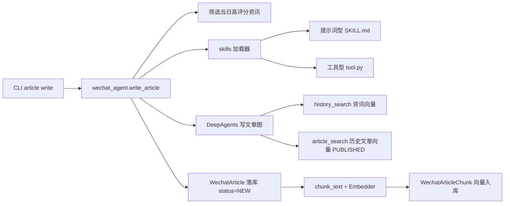

## 产品概述

新增「微信公众号文章 Agent」，基于现有 DeepAgents 框架，把每日财经资讯汇总成有「活人感」的公众号文章，覆盖宏观、行业、个股，语言生动活泼、带插科打诨与分析，避免机械 AI 腔。文章入库并向量化，支持引用历史已发布文章、跨文章记忆与连续性，避免重复讲解。提供 CLI 管理文章列表与状态。

按阶段交付：本期落地「文章存储 + 向量化 + 写文章 Agent + skills 机制 + CLI」；定时任务、微信发布、图片生成预留接口，后续实现。

## 核心功能

- 文章存储与状态：NEW（新建）/ DRAFT（草稿，已推公众号）/ PUBLISHED（已发布）/ DELETED（已删除），「草稿/发布」由用户手动设置。
- 写文章 Agent：读取资讯向量数据 + 历史文章向量数据（仅 PUBLISHED），每日汇总成文章。
- 历史文章 chunk + 向量化，供后续文章检索引用。
- Skills 机制：同时支持「提示词型技能」（skills/ 下 .md 注入 system prompt）与「工具型技能」（暴露为 Agent 可调用工具），目录默认 `skills/`，可用参数指定。
- CLI：列出文章、写文章、修改文章状态、查看文章。
- 分阶段预留：每日定时筛选资讯并写文章、微信发布（本期不接 API、状态手动改）、图片生成 skill（本期只留机制与字段）。

## 技术选型

完全复用现有技术栈，不引入新框架：

- 后端：Python 3.12 + SQLAlchemy 2.0 async + FastAPI（现有）
- Agent：DeepAgents（`deepagents.create_deep_agent`）+ LangGraph + LangChain 工具（现有）
- 向量：pgvector `HALFVEC(2048)` + 现有 `Embedder`、`chunk_text`
- 迁移：Alembic（`alembic revision --autogenerate`）
- CLI：沿用现有 argparse 命令分发（`cli.py` 的 `_dispatch`）

## 实现方案

### 总体思路

新增一个与现有「深度分析 Agent」平行的 `WECHAT_ARTICLE` Agent：在 `registry.AGENT_SPECS` 注册，`analysis_graphs.py` 的 `AGENT_GRAPH_CONFIG` / `MAIN_TOOLS` / `_subagents_for` 增加映射，业务入口放在新服务 `agents/wechat_agent.py`。文章与历史文章检索复用现有 `chunk_text` + `Embedder` + HNSW 向量检索模式。

### 关键设计决策

1. **文章独立建模**：新增 `WechatArticle`（主表）+ `WechatArticleChunk`（向量分块），不复用 `NewsChunk`（其 `news_id` 外键强绑定资讯）。分块表结构与 `NewsChunk` 对齐（HALFVEC(2048) + HNSW 索引），便于复用检索逻辑。
2. **历史文章检索只查 PUBLISHED**：新增 `article_search` 工具，向量检索 `WechatArticleChunk` join `WechatArticle`，SQL 强制 `status == PUBLISHED`，从数据层保证「只查已发布历史」。
3. **Skills 双形态统一加载**：`agents/skills/loader.py` 扫描 `skills_dir`，识别两种 skill——提示词型（`skills/<name>/SKILL.md`，YAML frontmatter + 正文，注入 system prompt）、工具型（`skills/<name>/tool.py`，导出 LangChain 工具，挂入 `MAIN_TOOLS`）。目录默认 `settings.skills_dir`，CLI `--skills-dir` 可覆盖。
4. **记忆与连续性靠「检索 + 提示词」实现**：主 Agent 系统提示词明确「写之前先用 article_search 回顾我已发布的历史文章，可引用『我之前的文章讲过…』，避免重复」；历史文章本身已向量化，检索即记忆，无需额外的显式记忆存储。
5. **微信发布与图片生成本期占位**：定义 `WechatPublisher` 抽象接口（`publish_draft()` 本期 no-op），文章表预留 `cover_image`/`images` 字段；图片生成 skill 后续在 `skills/` 下实现，本期只保证 skill 机制可加载工具型技能。

### 架构设计



## 目录结构

```
fin-news-v5/
├── src/fin_news/
│   ├── core/
│   │   ├── enums.py                    # [MODIFY] 新增 ArticleStatus、AgentType.WECHAT_ARTICLE
│   │   └── config.py                   # [MODIFY] 新增 skills_dir、wechat_* 预留配置
│   ├── models/
│   │   └── wechat.py                   # [NEW] WechatArticle + WechatArticleChunk 模型
│   ├── agents/
│   │   ├── schemas.py                  # [MODIFY] 新增 ArticlePayload 输出 schema
│   │   ├── prompts.py                  # [MODIFY] 新增 WECHAT_SYSTEM 提示词 + version
│   │   ├── registry.py                 # [MODIFY] 注册 WECHAT_ARTICLE AgentSpec
│   │   ├── wechat_agent.py             # [NEW] write_article 服务（筛选→构图→落库→向量化）
│   │   ├── skills/
│   │   │   ├── __init__.py             # [NEW] skills 包
│   │   │   └── loader.py               # [NEW] 扫描/加载提示词型 + 工具型技能
│   │   ├── tools/
│   │   │   ├── article_retrieval.py    # [NEW] article_search 底层函数 + LangChain 工具
│   │   │   └── langchain_tools.py      # [MODIFY] 导出 article_search_tool
│   │   └── graphs/
│   │       └── analysis_graphs.py      # [MODIFY] 增加 AGENT_GRAPH_CONFIG/MAIN_TOOLS/子agent/response_format
│   └── cli.py                          # [MODIFY] 新增 article 命令族
├── skills/
│   ├── README.md                       # [NEW] skills 目录说明与格式约定
│   └── .gitkeep                        # [NEW] 占位
├── alembic/versions/
│   └── 2026_09_04_0007_wechat_article.py  # [NEW] 迁移：article_status 枚举 + 两张表 + HNSW 索引
└── tests/
    └── test_wechat_agent.py            # [NEW] 模型/loader/检索/服务层单测
```

## 关键代码结构

### 1. 文章模型与状态枚举

```python
class ArticleStatus(StrEnum):
    NEW = "new"
    DRAFT = "draft"
    PUBLISHED = "published"
    DELETED = "deleted"

class WechatArticle(Base, PublicIdMixin, TimestampMixin):
    __tablename__ = "wechat_article"
    id: int  # PK
    title: str
    summary: str | None
    content: str                      # 正文 markdown
    status: ArticleStatus = NEW
    cover_image: str | None           # 封面 URL（图片 skill 后续填）
    images: dict = []                 # JSONB 配图列表
    publish_date: date                # 文章对应交易日/日期
    source_news_ids: dict = []        # JSONB 引用的资讯 id
    referenced_article_ids: dict = [] # JSONB 引用的历史文章 id
    prompt_version: str | None
    model: str | None
    tokens: int | None
    latency_ms: int | None
    published_at: datetime | None

class WechatArticleChunk(Base, TimestampMixin):
    __tablename__ = "wechat_article_chunk"
    id: int  # PK
    article_id: int  # FK wechat_article.id
    chunk_index: int
    content: str
    embedding: list[float]  # HALFVEC(2048)，HNSW 索引
    model: str
```

### 2. 输出 Schema（结构化输出契约）

```python
class ArticlePayload(BaseModel):
    title: str
    summary: str
    content: str                       # 正文 markdown
    topics: list[dict] = []            # 宏观/行业/个股 主题分类
    referenced_article_ids: list[str] = []  # 引用的历史文章 public_id
    cover_hint: str | None = None      # 封面建议
    tags: list[str] = []
```

### 3. Skill 文件格式（提示词型）

```markdown
---
name: example-skill
description: 一句话说明这个技能做什么
when_to_use: 何时应该启用该技能
---
（正文：给 Agent 的指令、风格、约束，加载后注入 system prompt）
```

工具型技能约定：`skills/<name>/tool.py` 导出一个 `get_tool()` 返回 LangChain 工具对象。

## 实现要点与注意事项

- **session 注入**：新增 `article_search` 工具需遵循 `langchain_tools.py` 现有的 DB session 注入模式（先探明现有工具如何拿到 session，保持一致）。
- **向量维度一致性**：`WechatArticleChunk.embedding` 必须用现有 `VECTOR_TYPE(settings.embedding_dim)`，写库前复用 `Embedder._validate` 维度校验，避免污染索引。
- **降级**：DeepAgents 图失败时复用 `analysis_agents._run_analysis` 的 legacy 单次调用降级路径（`_run_plain_agent` + `ArticlePayload`）。
- **查询范围强制**：`article_search` 的 SQL 必须 `where WechatArticle.status == PUBLISHED`，不依赖 Agent 自觉。
- **迁移**：新增 PG 枚举 `article_status` 用 `pg_enum(create_type=False)`，由迁移显式 `CREATE TYPE`；HNSW 索引写法对齐 `idx_chunk_embedding`。
- **配置**：`skills_dir: str = "skills"` 加入 `Settings`；微信发布相关（`wechat_appid`/`wechat_secret` 等）本期只留配置占位与注释，不接 API。
- **性能**：文章一次生成只做一次「资讯筛选查询 + 一次 DeepAgents 运行 + 一次文章 chunk/embed」，避免 N+1；历史文章检索 top_k 默认 8，与 `history_search` 一致。