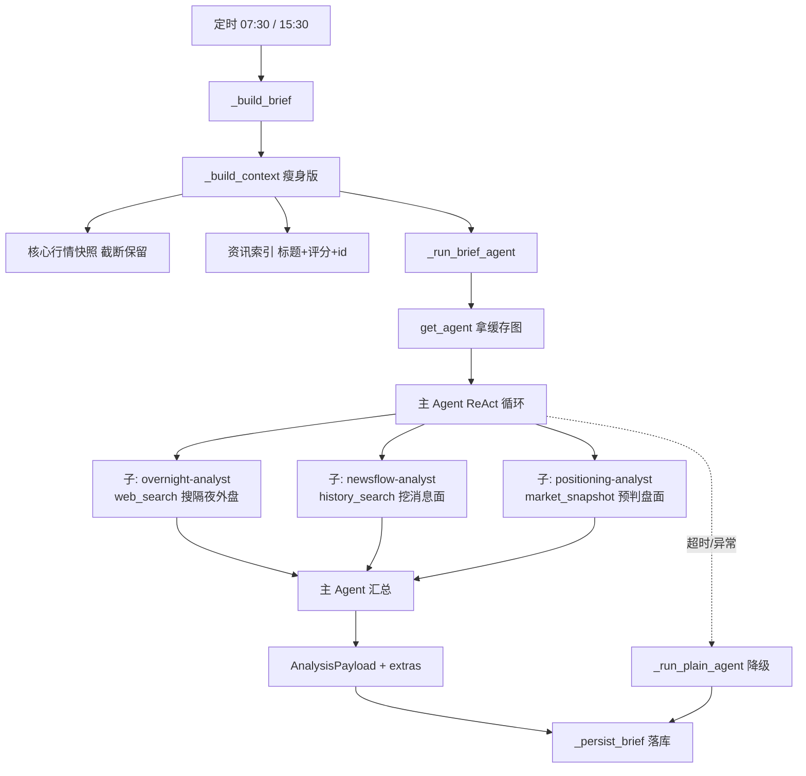

## 产品概述

将盘前/盘后简报生成从「一次性预取上下文 + 单 Agent 单次推理」改造为 **DeepAgents ReAct 深度分析**：Agent 自主决策、多轮调用工具补充检索、并行子 agent 分头深挖，从而产出更有依据的「今天为什么涨跌 / 今天怎么看」。

## 核心功能

1. **ReAct 深度分析**：盘前盘后保持 DeepAgents 架构（本身即 ReAct 循环），通过补足工具与子 agent 释放其自主检索能力，而非依赖预取喂料。
2. **外部信息检索**：给盘前盘后开放外部搜索工具，补齐 `us_daily` 无权限导致的隔夜外盘数据缺口，并补充机构解读、市场预期、海外反应。
3. **子 agent 并行**：盘前拆为隔夜外盘 / 消息面 / 盘面预判三路并行；盘后拆为盘面复盘 / 归因 / 次日展望三路并行，主 agent 只做汇总。
4. **上下文瘦身**：`_build_context` 从「全量预取内联」改为「核心行情快照 + 资讯索引」，把历史情境与外盘细节交给子 agent 按需检索。
5. **深度优先的耗时预算**：盘前盘后超时放宽到 600 秒，并接上真正的步数上限，避免无限循环。

## 边界与约束

- **输出契约不变**：`AnalysisPayload` 顶层 `headline` / `summary`，`extras` 仍承载 `verdict` / `attribution` / `market_stats` / `next_day_focus` / `us_market` / `focus_directions`，确保 `_persist_brief` 落库与前端 `/market/pre-market`、`/market/post-market` 消费不受影响。
- **外部搜索可缺位**：未配置搜索服务时，子 agent 优雅返回「不可用」提示并降低置信度，不得因搜索失败导致整图崩溃；保留 `_run_plain_agent` 兜底。
- 本轮为方案设计，不含代码改动。

## 技术栈

沿用现有栈，不引入新框架：

| 层 | 选型 |
| --- | --- |
| Agent 框架 | DeepAgents 0.7.11（`create_deep_agent`，本身即 ReAct 循环 + 中间件 + 子 agent） |
| 编排 | LangGraph（`CompiledStateGraph`） |
| 模型 | 火山引擎 / DeepSeek，OpenAI 兼容，按角色切换（analysis 角色，温度 0.2） |
| 外部搜索 | 用户自配搜索服务（博查 / Serper / Tavily 等），经 `WEB_SEARCH_*` 配置接入 |
| 数据 | SQLAlchemy + PostgreSQL / pgvector，现有 `market_data` / `retrieval` 工具层 |


## 实现思路

核心判断：**当前盘前盘后不是"不是 ReAct"，而是"ReAct 的检索能力被预取架空了"**——`_build_context` 把行情、资讯、历史、龙虎榜一股脑内联进 prompt，Agent 无需自主检索即可作答，等于退化成单次调用。改造方向是「抽掉喂料，补齐工具，拆分并行」。

### 关键决策与取舍

**决策 1：保持 DeepAgents，不换 `create_react_agent`**

DeepAgents 已经是 ReAct 循环（LLM 决策 → 工具调用 → 观察 → 循环），换成显式 ReAct 图要重写状态管理与入口，收益仅是"每轮决策更可见"。而当前缺口在工具与检索深度，不在循环机制。故沿用并复用 `_macro_subagents` 已验证的 `SubAgent` 模式，改动小、一致性高。

**决策 2：工具分配从「特判 macro」改为「声明式映射」**

现状 `_main_tools` 里 `web_search` 靠 `agent_type == MACRO_POLICY` 硬编码判断，新增 Agent 就要改判断式。改为按 Agent 声明工具集（映射表），扩展新 Agent 时只改数据不改分支。

**决策 3：上下文「保留骨架、抽掉细节」**

并非全部去掉预取——行情快照是 Agent 靠工具难以高效重建的（需多次 `market_snapshot` 调用），保留；而历史情境（向量检索）与外盘细节（搜索引擎）正是子 agent 的强项，删掉预取，交给它们按需深挖。这样既降低 prompt token，又让 ReAct 循环有真实检索动机。

**决策 4：超时与步数双刹车**

现状 `recursion_limit` 与 `timeout_seconds` 都声明在 `AgentSpec` 但**均未接线**，实际是无步数上限（LangGraph 默认 10007）+ 全局 300 秒超时。深度分析场景下必须：

- 超时：盘前盘后放宽到 600 秒（用户选深度优先），但分析类（macro/industry/stock）保持 300 秒，避免个股事件也拖到 10 分钟。
- 步数：接线 `recursion_limit` 到 `ainvoke(config=...)`，设合理值。注意 LangGraph 按**节点执行次数**计数，子 agent 内部也计步，故 12 明显偏小（会截断在检索中途），深度场景需上调。

### 性能与可靠性

- **并发**：子 agent 并行（同宏观 Agent 的历史/传导/外部模式），三路检索耗时约等于最慢的一路，而非累加。
- **降级链**：子 agent 工具失败 → 返回「不可用」字符串（现有 `web_search_tool` 已如此处理）→ 主 agent 降低该维度置信度继续汇总 → 整图仍失败则 `_run_plain_agent` 单次调用兜底。
- **成本**：深度分析 token 显著上升，但因盘前盘后每日仅各 1 次，总量可控；分析类（逐条资讯）不在此列，不受影响。

## 实现要点（执行细节）

1. **`web_search` 工具的幂等安全**：现有实现未配置时抛 `WebSearchUnavailable`，`langchain_tools.web_search` 已捕获并转成字符串。新增子 agent 直接复用该工具即可，无需重复兜底。
2. **截断保护**：`market` / `prev_market` / `top_list` / `us_market` 目前未截断（`_build_context` 第 177-181 行），是 token 大头。瘦身时统一加截断（参考 `qa_agent.py` 的 `[:1500]` 惯例）。
3. **`_news_ids` 必须保留**：`_persist_brief` 用它填 `references`，上下文瘦身时不要误删。
4. **版本一致性**：改 prompt 时必须同步 bump `PRE_MARKET_VERSION` / `POST_MARKET_VERSION`，并使其与 `registry.AGENT_SPECS` 的 `prompt_version` 一致（现有 `test_graph_config_versions_match_registry_specs` 会守住这点）。
5. **`with_fallback=False` 的既有约束**：`build_analysis_graph` 刻意不用 `with_fallbacks()`（deepagents 的 `resolve_model` 会把 `RunnableWithFallbacks` 当字符串导致 `AttributeError`），新增子 agent 时不要改动此行。

## 架构设计

改造后盘前（盘后同构，子 agent 不同）的执行流程：



## 目录结构

```
src/fin_news/
├── agents/
│   ├── graphs/
│   │   └── analysis_graphs.py     # [MODIFY] 新增 _pre_market_subagents / _post_market_subagents；
│   │                              #          工具分配改声明式映射并给盘前盘后开放 web_search；
│   │                              #          run_analysis 接线 timeout 与 recursion_limit
│   ├── market_agents.py           # [MODIFY] _build_context 瘦身（截断+去掉历史预取）；
│   │                              #          _run_brief_agent 传入盘前盘后专用超时
│   ├── prompts.py                 # [MODIFY] PRE/POST_MARKET_SYSTEM 与 USER_TEMPLATE 引导工具检索；
│   │                              #          bump 版本号（pre_market.v3 / post_market.v3）
│   └── registry.py                # [MODIFY] pre/post_market 的 timeout_seconds=600、
│   │                              #          recursion_limit 上调至深度场景合理值
├── core/
│   └── config.py                  # [MODIFY] 新增 brief_timeout_seconds: int = 600
└── tests/
    └── test_analysis_graphs.py    # [MODIFY] 补子 agent 与工具分配的断言
```

## 关键代码结构

改造依赖的核心抽象（沿用现有 `SubAgent` 结构，仅列出新增部分的形态）：

```python
# analysis_graphs.py —— 子 agent 工厂（与 _macro_subagents 同构）
SubAgent = dict  # 实际为 deepagents.middleware.subagents.SubAgent
# 关键字段：name / description / system_prompt / tools

def _subagents_for(agent_type: AgentType, settings: Settings) -> list[SubAgent] | None:
    """按 Agent 类型返回并行子 agent；web_search 未配置时剔除依赖搜索的子 agent。"""
```

盘前盘后各子 agent 的工具分配：

| Agent | 子 agent | 工具 | 职责 |
| --- | --- | --- | --- |
| 盘前 | `overnight-analyst` | `web_search` | 隔夜美股/欧股/大宗商品表现，补 `us_daily` 无权限缺口 |
| 盘前 | `newsflow-analyst` | `history_search` | 隔夜高评分资讯主线识别 |
| 盘前 | `positioning-analyst` | `market_snapshot`, `stock_lookup` | 昨日收盘状态 → 今日开盘预判 |
| 盘后 | `tape-analyst` | `market_snapshot`, `stock_lookup` | 涨跌结构、板块轮动、龙虎榜 |
| 盘后 | `attribution-analyst` | `history_search` | 资讯与指数波动归因，挂 news_id |
| 盘后 | `outlook-analyst` | `web_search` | 机构解读、次日预期、海外反应 |
